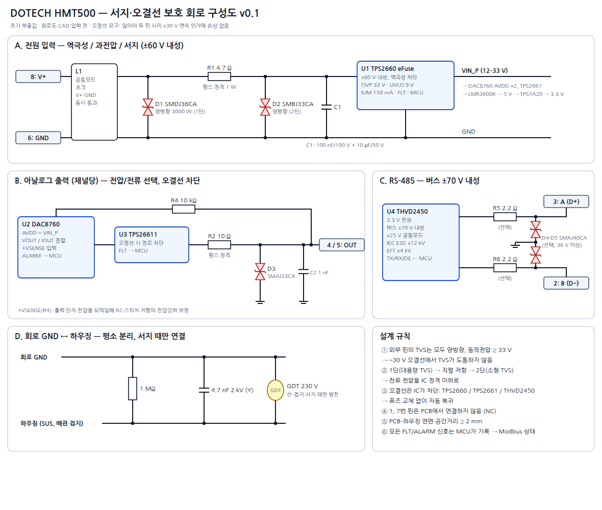

# HMT500(260313) 회로 설계서 (서지·오결선 보호 포함) — 회로도 v0.10

> **PCB A1 초안 (#42–43):** L2/L3를 SMNR4020 제조사 랜드로 수정. 회로 연결/값은 유지. PCB 배선은 미완성이며 제작 승인 상태가 아니다. [아트워크 상태](artwork-a1-261001.md).

> **회로 최신 결정 #41 (2026-10-01, v0.10):** AO D30/D40 = TVS1401DRBR(±14 V)로 변경. 입력 D2·RS-485 D60/D61은 TVS3301 유지. VAO 16.1 V 유지. AO ±28/30 V 지속 오결선 보장은 제외한다. 아래 과거의 모든 핀 ±30 V 무손상 요구·출력 TVS3301 유지 설명보다 이 결정이 우선한다. [변경 검토](ao-tvs1401-261001.md).

> **v0.9 (2026-09-30, 결정 #32):** 3중 검토([final-review-260313A.md](final-review-260313A.md)) 반영. OVP 32.6 V(R5 36.5 k, 복귀 30.1 V) + TPS26611 +Vs 27 V 제너 클램프, D2 → TVS3301, eFuse 입력 C2 2.2 µF, 벅 입력 220 nF × 2 + C5 벌크를 U2 옆에, U2 핀 3 = SW, RS485_DE 10 k 풀다운, THVD2410, X7R만 사용, R2 고전압 1206, SGOOD → PA0/PA4, CS_CDC → PA15, VIN_SENSE → PB0, LATCH·CS 풀업, OPA197 V+ = DAC AVDD, R31/R41 100 k, 보조 시트(Aux). **입력 절대 최대 33 V DC 연속** (TVS). 아래 본문의 v0.8 이전 값은 이 줄이 우선합니다.
>
> **v0.9 외부 검수 반영 (2026-09-30, 결정 #35, [external-review-response-260930.md](external-review-response-260930.md)):** D2 뒤·U1 앞 **직렬 쇼트키 D3 PMEG10010ELR (100 V)** — 음(−) 서지·역극성은 D3가 받아 eFuse IN–OUT 역전압 없음, U1 입력 넷 = VIN_D. **RS-485 버스 TVS D60/D61 = TVS3301** (A·B–GND). U11 → **THVD2410DGKR (VSSOP-8, 같은 핀)**. +Vs 제너 **BZX84C24** (27 → 24 V, +Vs 최악 ≤ 26.4 V). **C7 삭제** (D3로 VIN_P 유지 필요 없음, 벌크 C5·C43 유지). ADS1220 **IDAC = 250 µA 고정**.
>
> **결정 #37 (2026-10-01, DAC 부분 확정 — VibrationSensor IVS320 AO rev 1.0 방식):** AO 전용 전원 **VAO 16.1 V** (벅 U15 LMR51606YFDBVR + L3 22 µH + C64/C65) → DAC AVDD(10 Ω)·TPS26611 +Vs·OPA197 V+. 제너 폴로워(Q1·R50·D50·C53)·C43 삭제. DAC CMP 보상 4.7 nF(VOUT–CMP) + 100 pF(CMP–GND), DAC 출력 클램프 BAS70-04 (D41/D51). 출력 TVS3301·SGOOD→ADC는 유지. DAC 손실 28 V 단락 0.66 → 0.39 W/채널.
>
> **결정 #38 (2026-10-01, JLC 부품 우선):** 5 V 벅 U2 = **LMR51606YFDBVR** (1.1 MHz, L2 10 µH, C6 22 µF, R8/R9 118k/22.1k → 5.07 V; 아래 본문의 LMR36006 값은 이 줄이 우선). R19 = ERA-3AEB4021V (0.1 %·25 ppm), R1·R30·R40 = CRCW2512 일반형.

작성일: 2026-09-26 · 상태: 상세 회로 설계안 (회로도 CAD 입력 전). 부품값은 초기값이며, 평가보드와 EMC 사전시험으로 확정합니다.



원본: [protection-schematic.svg](protection-schematic.svg) · 블록도: [block-diagram.png](block-diagram.png) · 블록 설계: [hardware-block-design.md](hardware-block-design.md)

---

## 1. 보호 요구사항

### 1.1 오결선 (Miswiring)

> **요구:** 커넥터의 **어떤 두 핀 사이에 −30 ~ +30 V DC를 연속으로 걸어도 손상이 없어야** 합니다. 결선을 바로잡으면 자동으로 정상 복귀해야 합니다(퓨즈 교체 없음).

| 오결선 상황 | 보호 수단 | 결과 |
|---|---|---|
| 전원 역극성 (V+ ↔ GND 바뀜) | eFuse **TPS2660** (±60 V, 역극성 차단 내장) + **양방향** TVS | 차단, 복귀 후 정상 |
| 전원 과전압 (연속 최대 33 V — TVS 정격) | TPS2660 과전압 차단 (OVP 32.6 V, 복귀 30.1 V, v0.9) | 차단, 복귀 후 정상. 33 V 초과 연속 인가는 TVS 손상 (60 V 내성 아님) |
| 전원이 아날로그 출력 핀에 연결됨 (±30 V) | 출력 보호 스위치 **TPS2661** (50 V) + 양방향 TVS + 직렬 저항 | DAC와 분리됨, FLT 신호 발생 |
| 아날로그 출력 단락 (GND, 다른 출력) | DAC8760 내장 전류 제한 + 단락/단선 감지 | 출력 제한, ALARM |
| 전원이 RS-485 A/B에 연결됨 (±30 V) | **THVD2410** 버스 ±70 V 내성 (v0.9, 이전 THVD2450) | 통신만 중단, 손상 없음 |
| RS-485와 아날로그 출력이 서로 바뀜 | 위 두 보호의 조합 | 손상 없음 |
| 1, 7번 핀 (예비)에 무엇이 연결되든 | PCB에서 **연결하지 않음(NC)** | 영향 없음 |

> **변경 제안:** 앞서 7번 핀을 아날로그 GND로 쓰자고 했지만, 오결선 요구를 고려해 **7번은 NC로 되돌립니다**. 7번이 GND에 직결되어 있으면 V+를 7번에 잘못 물렸을 때 전원이 단락됩니다. 대신 전압 출력은 DAC8760의 +VSENSE로 PCB 출력단 전압을 보정하고, 케이블 GND 전압강하(3선식)는 오차 예산에 포함합니다(6.1절).

### 1.2 서지·과도 (설계 목표)

IEC 61326-1 산업 환경 요구보다 여유 있게 잡은 설계 목표입니다. 규격의 정확한 적용 레벨은 시험소와 확인이 필요합니다.

| 시험 | 규격 | 전원 포트 | 신호 포트 (RS-485, 아날로그) |
|---|---|---|---|
| 서지 | IEC 61000-4-5 | **±1 kV 선–접지, ±1 kV 선–선** | **±1 kV 선–접지** |
| 버스트(EFT) | IEC 61000-4-4 | ±2 kV | ±2 kV |
| 정전기(ESD) | IEC 61000-4-2 | 접촉 ±8 kV, 기중 ±15 kV (커넥터, 하우징) | 같음 |
| 전도 RF | IEC 61000-4-6 | 10 Vrms | 10 Vrms |

**판정 기준:** 시험 중에는 일시적인 성능 저하를 허용하고, 시험 후에는 자동으로 복귀해야 합니다(기준 B). 손상이나 설정값 손실은 허용하지 않습니다.

## 2. 전원 입력부

```
커넥터 8 (V+) ─┬─[FB1]─┬─[R1 4.7Ω 펄스]─┬──────────── TPS2660 IN ──► VIN_P (≤29 V)
               │       │                │
             [D1]    [C1]             [D2]            TPS2660: OVP 29 V, UVLO 8.6 V, ILIM 149 mA
             양방향   100nF           양방향                    FLT → MCU
               │     100V               │
커넥터 6 (GND) ┴───────┴────────────────┴──────────── GND
```

| 기호 | 부품 | 값 / 품번(안) | 역할 |
|---|---|---|---|
| L1 | 공통모드 초크 | 2×1 mH급, 정격 0.3 A 이상 (예: Würth WE-SL 계열) | EFT, 전도 RF 저감. V+와 GND 동시 통과 |
| D1 | TVS 양방향 (1단) | **SMDJ36CA** (3000 W, Vbr 약 40 V) | 서지 주 흡수. **양방향이어야** 역극성 −30 V에서 도통하지 않음 |
| R1 | 펄스 내성 저항 | 4.7 Ω, 1 W, 펄스 정격 (MELF 또는 CRCW-HP) | 1단·2단 사이 전류 분담. 정상 전류 55 mA에서 전압강하 약 0.26 V |
| D2 | TVS 양방향 (2단) | **TVS3301DRBR** (v0.9, 이전 SMBJ33CA) | 평탄 클램프 약 42.5 V → 음(−) 서지에서 eFuse IN–OUT이 정격(−70 V / 10 ms 이하 펄스) 안에 머묾. U1 옆. **입력 DC 절대 최대 33 V** (TVS3301은 DC 약 34.5 V 이상에서 손상) |
| C1 | 세라믹 | 100 nF / 100 V + 10 µF / 50 V | 입력 안정, EFT |
| U1 | eFuse | **TI TPS26600PWPR** | 역극성(−60 V) 차단, OVP 32.6 V (복귀 30.1 V), UVLO 8.9 V, 전류 제한 149 mA, 돌입 전류 제어. 입력 C2 2.2 µF 100 V (v0.9) |
| FB1 | 페라이트 비드 | 600 Ω @100 MHz | 고주파 |

- **TPS2660 설정:**
  - **v0.9:** R5 **36.5 k** → OVP 상승 **32.6 V** (31.5–34.2), 하강(복귀) **30.1 V** (29.2–31.4), UVLO 8.9 V. v0.8(29 V)은 복귀가 약 27 V라 26–28 V 전원에서 한 번 차단되면 켜지지 않는 문제가 있었습니다(검토 A1). TPS26611 +Vs·DAC AVDD·OPA197 V+ = **VAO 16.1 V 벅** (U15 LMR51606, 결정 #37 — 이전 결정 #35의 24 V 제너 폴로워 대체).
  - 전류 제한 I_OL = 12 / R6[kΩ] → R6 **80.6 k** = 149 mA (12 V 입력 최대 부하 약 90 mA의 약 1.6배, 검토 계산).
  - **RTN (EF_RTN):** 데이터시트 9.3.5.5 — "RTN을 GND에 연결하면 역극성 보호가 꺼지고 역극성 때 영구 손상". R5·R6·C4·MODE와 방열 패드는 **RTN에 연결하고 GND와는 연결하지 않습니다** (v0.7의 R22 0 Ω 링크 삭제). GND 핀(9)만 시스템 GND. IMON은 쓰지 않아 개방(데이터시트 허용, R7 삭제). SHDN 개방 = 켜짐(내부 2.7 V).
  - FLT 출력은 MCU로 연결해 전원 이상 이력을 기록합니다.
- **동작 전원 범위:** **12–28 V DC, 최대 28 V** (v0.8 결정 #26, 확정 #36 — 이전 12–30 V). 전류 출력 부하 RL ≤ 500 Ω (V+ ≥ 18 V), 18 V 미만 RL ≤ (V+ − 6 V)/24 mA. EE364 전원(10–28 V)과 상한이 같습니다.
  - 전류 출력 최대 부하 = (V+ − 3 V) / 24 mA − 25 Ω (DAC 여유 AVDD − 2 V, R34 10 Ω·R1·eFuse 강하 약 1 V, TPS26611 RON 최대 12.5 Ω, R30 10 Ω) → **12 V: 약 350 Ω, 24 V: 약 850 Ω**. 사용 설명서 사양에 기재.
- **VIN_P 레일:** DAC8760 AVDD ×2와 LMR36006 입력에 공급합니다.

### 2.1 내부 전원

| 레일 | 부품 | 부하 |
|---|---|---|
| VIN_P (12–28 V, 최대 29 V) | TPS2660 출력 | DAC8760 AVDD ×2 (각 10 Ω 직렬), TPS26611 +Vs, OPA197, 벅 입력 |
| 5 V | **LMR36006** 벅 (4.2–60 V 입력), 인덕터 15 µH, 입력 220 nF × 2 (핀 옆) + C5 10 µF | LDO 입력 |
| 3.3 V | **TPS7A2033** 저잡음 LDO (입력 C26 1 µF) | MCU, PCAP04, ADS1220, THVD2410, DAC8760 DVDD(외부 공급 모드) |
| 3.3 V_A | 3.3 V + 페라이트 + 10 µF | PCAP04, ADS1220 아날로그 전원 분리 |

## 3. 아날로그 출력부 (채널당, 2채널 동일) — 회로도 v0.8 (결정 #24, #26)

```
               ┌─────────────── +VSENSE ◄── U12 OPA197 (이득 1) ◄── R31 10k ◄───┐
DAC8760  VOUT ─┤                                                                 │
(AVDD=VIN_P    ├── U9 TPS26611 ── R30 10Ω ──┬────┬──────────────────────────────┴──► 커넥터 4 (OUT1) / 5 (OUT2)
  via R34 10Ω) ─┘   (오결선 차단)   펄스     D30  C41
         IOUT ──(VOUT와 합침)                TVS3301
         ISET-R ── R32 15k 0.1% ── GND     TVS  1nF
         ALARM ──► MCU                      │    │
         SPI2: DIN·SDO 공유, SCLK = SCK OR LATCHn (U14)   GND  GND
```

| 기호 (회로도) | 부품 | 값 / 품번(안) | 역할 |
|---|---|---|---|
| U7, U8 | 출력 DAC | **TI DAC8760IPWP** (16-bit, 4–20/0–20/0–24 mA, 0–5/0–10 V), HTSSOP-24 | 출력 생성. 내장 기준전압, 영점·이득 교정 레지스터. 단선·단락·과열 → ALARM. **핀 번호는 데이터시트(SBAS528D) 기준으로 확정** (v0.7, VibrationSensor IVS320과 같은 심볼) |
| U9, U10 | 오결선 보호 스위치 | **TI TPS26611DDFR** (SOT-23-8) | 단자 전압 > +Vs + 0.05–0.3 V 또는 < −0.2–−0.4 V면 5 µs 안에 차단, 정상화 후 21 µs에 자동 복귀. 전류 제한 32 mA(25–40), 65 mA 넘는 급한 과전류는 5 µs 차단. MODE = GND: 100 ms 제한 후 차단, 0.8 s 재시도. RON 7.5 Ω. −Vs = GND, EN 개방(내부 풀업). **SGOOD: Low = 정상** → MCU PC6/PC7 (보호 방식 통일 검토는 보류 — #24) |
| R30, R40 | 펄스 저항 | 10 Ω, 2512, 펄스 정격 | 서지 전류 제한 (전압 모드 오차는 +VSENSE로 보정) |
| D30, D40 | 평탄 클램프 TVS 양방향 | **TI TVS3301DRBR** (SON-8 3×3, 패드 개방) | TPS2661 데이터시트 Fig. 9-14 권장품. 33 V 스탠드오프, **40 V @ 27 A** 클램프 → TPS26611 IN/OUT 절대최대 ±55 V에 여유 (SMAJ33CA는 약 53 V). 누설 ≤ 450 nA(85 °C) |
| C41, C51 | C0G/X7R | 1 nF / 100 V | EFT, RF |
| U12, U13 | **+VSENSE 버퍼** | **TI OPA197IDBVR** (36 V, 레일투레일), SOT-23-5, V+ = VIN_P | 단자 전압(R30 뒤)을 +VSENSE로 전달. 전류 모드에서 +VSENSE 내부 약 60 kΩ로 새는 전류(250 Ω 부하에서 약 0.4 % 오차)를 없앰 (데이터시트 Figure 9-2) |
| R31, R41 | 저항 | 10 kΩ | 버퍼 + 입력 보호 (단자 서지 전류 제한) |
| R32, R42 | **외부 ISET-R** | **15 kΩ 0.1 % 25 ppm/K** | 전류 출력 기준. 내부 저항보다 온도 드리프트가 작음 (펌웨어에서 외부 ISET 선택 비트 설정) |
| C45, C55 | 바이패스 | 100 nF / 50 V | OPA197 V+ |
| R34, R44 | 저항 | 10 Ω | DAC8760 AVDD 직렬 — 데이터시트 10장 CAUTION (전원 상승 1 V/ns 이하). C42·C52 100 nF가 10 Ω 뒤 AVDD 바이패스 |
| C43 | 벌크 | 4.7 µF / 50 V | VIN_P 벌크, 두 채널 공용 (C53 삭제) |

- **DAC8760 미사용 핀 처리:** DVDD-EN = GND (내부 DVDD 레귤레이터 끔, DVDD = +3V3), CLR·CLR-SEL = GND, −VSENSE = GND, BOOST·CMP·HART-IN = 연결 안 함, 방열 패드(EP) = GND.
- **VOUT와 IOUT 결합:** 데이터시트 9.1.1.3처럼 VOUT와 IOUT를 한 출력 단자로 모읍니다 (VibrationSensor IVS320과 같음).
  - 전환 순서: 출력 끄기 → 범위 변경 → 출력 켜기.
- **OPA197 안정도:** 버퍼 출력이 +VSENSE(고임피던스)만 구동하므로 이득 1 안정. 배치 때 +VSENSE 선을 짧게 하고, 필요하면 출력에 작은 직렬 저항 자리를 둡니다 (보드 시험 항목).
- **TPS26611 전압 출력:** 데이터시트 9.1 — TPS26611/12는 전압 출력 보호에도 쓸 수 있음 (확인 완료). RON은 +VSENSE 되먹임 안에 있어 전압 오차로 남지 않음.
- **TPS26611 한계 (시험 항목):** 차단 기준이 "+Vs보다 높은가"이므로, 우리 전원과 같거나 낮은 전압(예: 24 V 전원에 현장 24 V)이 단자에 물리면 차단 대신 32 mA 제한 → 100 ms 뒤 차단 → 0.8 s 재시도로 보호. 그동안 DAC VOUT에 전류가 흐름 → 오결선 매트릭스 시험에서 DAC 온도·복귀 확인.
- **발열 (2채널):** 전류 모드에서 DAC 전원과 부하 전압의 차이가 DAC 안에서 열이 됩니다. 보통(24 V, 20 mA, 250 Ω) 채널당 약 0.38 W, 최악(28 V, 24 mA, 부하 ≈ 0) 채널당 약 0.66 W, 두 채널 약 1.3 W (DAC RθJA 32.9 °C/W → 칩 약 +22 °C). 대책: ① 사양에 최소 부하 250 Ω 권장, ② 쓰지 않는 채널은 출력 끔(OUTEN = 0, 전원 켤 때 기본값), ③ PCB에서 두 DAC를 떨어뜨리고 방열 패드를 바디 쪽 금속으로 방열. 외장 트랜지스터(BOOST)는 시작품 온도 시험 후 판단.

## 4. RS-485부

```
MCU USART2 TX/RX/DE ── THVD2410 (3.3 V, DE 10k 풀다운 R60) ──┬──┬── 커넥터 3 (A, D+)
                        버스 ±70 V 내성                  │  │
                        IEC ESD ±12 kV                 [D4][D5]  양방향 TVS SMAJ40CA ×2 (선택)
                                                         │  │
                                                  ──────┴──┴── 커넥터 2 (B, D−)
```

| 기호 | 부품 | 값 / 품번(안) | 역할 |
|---|---|---|---|
| U11 | RS-485 트랜시버 | **TI THVD2410** (v0.9, THVD2450과 같은 핀·보호, 500 kbps 느린 에지) (±70 V 버스 내성, ±25 V 공통모드, IEC ESD ±12 kV, EFT ±4 kV, 50 Mbps) | 오결선 ±30 V에 손상 없음 |
| D4, D5 | TVS 양방향 (선택) | **SMAJ40CA** (Vc 약 65 V) | 서지 1 kV 대응 보강. **동작 전압이 36 V 이상**이어야 ±30 V 오결선 내성을 해치지 않음 (SM712 같은 저전압 TVS는 쓰지 않음) |
| R5, R6 | 펄스 저항 | 2.2 Ω (선택) | TVS와 트랜시버 사이 전류 분담 |

- 서지 사전시험에서 트랜시버 단독으로 통과하면 D4, D5, R5, R6는 미실장(DNP)으로 원가를 줄입니다.
- 종단 120 Ω은 내장하지 않고, 페일세이프는 트랜시버 내장 기능을 씁니다.
- 기본 통신 설정: 19200 bps 8E1, 주소 1. EE364 호환 모드에서는 9600 8E1, 주소 243.

## 5. 접지와 하우징 (서지 경로)

```
회로 GND ──┬── 1 MΩ ───────┬── 하우징(SUS, 배관을 통해 대지)
           ├── 4.7 nF 2kV ─┤
           └── GDT 230 V ──┘
```

- 하우징은 공정 배관을 통해 대지에 연결됩니다. 회로 GND를 하우징에 직결하면 4–20 mA 수신기와의 접지 루프 문제가 생기므로 **평소에는 분리(플로팅)** 합니다.
- **4.7 nF (2 kV, Y 등급)**: 고주파(EFT, RF)를 하우징으로 흘립니다.
- **1 MΩ**: 정전기 전하를 천천히 방전합니다.
- **GDT 250 V (Bourns 2035-25-SM, 2전극 — LCSC 품번, 이전 2035-23 230 V)**: 선–접지 서지(1 kV) 때만 방전해 회로 전체를 하우징 전위로 묶습니다. 그러면 각 핀의 TVS가 선–선 에너지만 처리합니다.
- **절연 거리:** PCB와 하우징 사이의 연면·공간 거리는 2 mm 이상을 목표로 합니다(GDT 방전 전 1 kV를 견뎌야 함).
- 커넥터 쉘은 하우징에 연결하고, 차폐 케이블 사용을 권장합니다.

## 6. 측정부·MCU (요약)

블록 설계서와 같습니다. 핀 할당(안)은 아래와 같습니다. STM32G0B1CCT3(LQFP48) 기준이며 CubeMX로 확정합니다. 핀 번호는 KiCad 공식 심볼 기준입니다.

| 기능 | MCU 핀 (안) | 상대 부품 |
|---|---|---|
| SPI1 SCK / MISO / MOSI (모드 1) | PA5 / PA6 / PA7 (16/17/18) | ADS1220 |
| **SPI3 SCK / MISO / MOSI** (모드 1) | **PB3 / PB4 / PB5 (42/43/44)** | **PCAP04 전용** (v0.8 — PCAP04 MISO는 PG1 겸용 핀이라 SSN High 때 Hi-Z 보장이 데이터시트에 없음) |
| CS: PCAP04 / ADS1220 | PB0 / PB1 (19/20) | |
| **SPI2 SCK / MISO / MOSI** (AF0, **모드 3**) | **PB13 / PB14 / PB15 (25/26/27)** | DAC8760 ×2 — DIN·SDO 공유, SCLK는 U14 OR 게이트로 DAC별 게이트 (v0.8) |
| **DAC1_LATCH / DAC2_LATCH** | **PB10 / PB11 (22/23)** | U7 / U8 LATCH + U14 SCLK 게이트 |
| ADS1220 DRDY | PB2 (21, EXTI) | |
| PCAP04 INTN | PB12 (24, EXTI) | |
| USART2 TX / RX / DE | PA2 / PA3 / PA1 (13/14/12) | THVD2410 D / R / DE+/RE, DE 10 k 풀다운 (자체 부트로더, 결정 #31) |
| DAC_ALARM (두 채널 wired-OR, R33 10 k 풀업) | PB6 (45) | DAC8760 오픈 드레인 — 채널은 상태 레지스터로 구분 |
| TPS26611 SGOOD ×2 (Low = 정상) | **PA0 / PA4 (11/15)** (v0.9) | High 2.0–3.0 V라 ADC로도 판정 가능, EXTI 0·4 (충돌 없음) |
| PCAP04 CS | **PA15 (37)** (v0.9, 이전 PB0) | 100 k 풀업 R13 |
| VIN_SENSE (VIN_P / 11) | **PB0 (19, ADC_IN8)** (v0.9) | 32.6 V → 2.96 V |
| DAC LATCH 풀업 · ADS1220 CS 풀업 | R10/R11 10 k, R12 100 k | 리셋 중 입력 고정 |
| TPS2660 FLT | PB7 (46, 내부 풀업) | |
| (상태 LED 삭제) | PB5 (44) 미사용 | 몰딩 후 보이지 않아 삭제 (#22). 상태는 Modbus로 |
| SWD | PA13 / PA14 (35/36), NRST = PF2 (10) | 생산 기록용 패드. M0+라 SWO 없음 |
| BOOT0 | PA14와 공유, 풀다운 없음 | 옵션 바이트 nBOOT_SEL=1, nBOOT0=1 → 플래시 부팅 |

### DAC SPI — SCLK 게이트 방식 (결정 #26, 회로도 v0.8)

v0.7의 데이지 체인은 **DAC8760 데이터시트 Rev D(2021-12)에서 기능이 삭제**되어(DCEN 비트 → Reserved) 쓰지 않습니다. 데이터시트 8.5.1.5: "LATCH가 통신을 게이트하지 않으므로 SCLK를 게이트하지 않고 여러 개를 병렬 연결하지 말 것" (Fig. 8-9).

- 배선: DAC_MOSI → U7·U8 DIN (공유), U7·U8 SDO → DAC_MISO (공유 — SDO는 LATCH 상승 뒤 3-state, t20 35 ns), **DACn_SCLK = DAC_SCK OR DACn_LATCH** (U14 SN74LVC2G32).
- **SPI2 모드 3** (CPOL = 1, CPHA = 1): SCK가 High로 쉬므로 LATCH가 내려가고 올라갈 때 OR 출력에 여분의 클록 에지가 생기지 않음. DAC는 SCLK 상승에서 DIN을 읽고, SDO는 하강에서 바뀌어 상승에서 유효 → 모드 3와 맞음.
- 쓰기: LATCHn Low → 24비트 → LATCHn High (그 DAC만 갱신). 두 채널을 거의 동시에 바꾸려면 연달아 두 번 씀.
- ALARM: 오픈 드레인 두 개를 한 선(DAC_ALARM)으로 묶고 R33 10 kΩ 풀업(데이터시트: 외부 10 kΩ 필요). 어느 채널인지는 상태 레지스터를 읽어 확인.
- 펌웨어: 제어 레지스터 REXT = 1 (외부 ISET-R R32/R42 사용), 쓰지 않는 채널 OUTEN = 0.

### 5A. 부품 정리 (결정 #22, 회로도 v0.6) — 91 → 75개

| 삭제 | 이유 |
|---|---|
| R11–R15 풀업 10k ×5 | v0.8: PWR_FLT만 MCU 내부 풀업(PB7). TPS26611 SGOOD는 푸시풀이라 풀업 불필요. DAC ALARM은 데이터시트대로 외부 10 k 1개(R33) |
| D3 LED + R16 | 전체 몰딩 후 보이지 않음. 상태는 Modbus 레지스터 |
| R60·R61, D60·D61 (RS-485) | THVD2450 자체 ±70 V·IEC ESD 보호. 몰딩 후 선택 장착 불가 |
| FB2 + C19 (VREF+ 필터) | MCU ADC는 측정에 안 씀 (내부 온도센서·진단만). VREF+ = +3V3, C20 100 nF |
| C11 (LDO 입력) | 바로 옆 벅 출력 C10 22 µF가 겸함 |
| C2 (eFuse 앞 10 µF), C6 (eFuse 뒤 100 nF) | C1(앞), C5·C7(뒤)과 역할 겹침 |

v0.8 처리: R7 삭제(IMON 개방 허용), R22 삭제(RTN–GND 연결 금지), C53 삭제(C43 공용), C26 삭제(PCAP04 VDD18 1핀), R33 용도 변경(ALARM 풀업). 남은 후보: D2+R1 (서지 시험), R31·R41 (전류 전용 출력 확정 시), 지지링 M-106 (몰딩 전 취급).

### 5B. PCB 내부 온도 측정 (결정 #23) — 부품 추가 없음

| 측정점 | 방법 | 위치 | 용도 |
|---|---|---|---|
| **앞쪽 (측정부)** | **ADS1220 내부 온도센서** (TS 모드, 14비트, 0.03125 °C/LSB, 정확도 데이터시트 확인) | J3·PCAP04·기준저항 R19·기준 C22 옆 | 측정 회로 드리프트 보상: R19(5 ppm/°C), C22(C0G), PCAP04 내부 오프셋, 하네스·커넥터 리드 저항 온도 변화 |
| **가운데 (MCU·전원·출력)** | **STM32G0 내부 온도센서** (ADC TS 채널, 공장 교정값 TS_CAL1/TS_CAL2, 주소는 RM0444 확인) | MCU (x 41) — 벅·DAC 사이 | DAC 출력 드리프트 보상, 전자부 과열 경보 (예: 85 °C 경고, 105 °C 알람), 수명 기록 |

- **측정 순서 (펌웨어):** ADS1220은 Pt1000 변환 사이에 1초마다 한 번 TS 모드로 바꿔 읽습니다. MCU 온도는 ADC로 1초마다 읽고 이동 평균합니다.
- **보상 방법:** 교정 때 전자부만 온도 챔버에서 2~3점(예: 25·60·85 °C)으로 돌려, "보드 온도 → aw·온도·출력 오차" 계수를 구해 EEPROM(플래시)에 저장합니다. 몰딩 경화 후에 교정합니다.
- **Modbus:** 보드 온도 2개를 입력 레지스터로 공개하고, 과열 상태 비트를 둡니다.
- 정밀도가 더 필요하면(±0.1 °C) 디지털 센서(예: TMP117) 1개를 추가할 수 있습니다. 지금은 부품 추가 없이 두 내부 센서로 충분하다고 판단합니다.

### 6.0 센서 접속 J3 (결정 #16)

| J3 핀 | 넷 | 상대 | 비고 |
|---|---|---|---|
| 1 | SENS_C1 | PCAP04 PC2 | MK33 전극 |
| 2 | SENS_C2 | PCAP04 PC3 | MK33 전극 |
| 3 | PT_P | ADS1220 AIN0 (IDAC) + R17 → AIN1 | Pt1000 +, 힘/감지 분기점 = J3 패드 |
| 4 | PT_N | R18 → AIN2 + 기준저항 R19 (REFP0) | Pt1000 −, 전류 귀환 |

- 커넥터: **JST SH 1.0 mm 4핀 SM04B-SRSS-TB** (옆 삽입·직각 SMD, 입구 앞쪽), 하네스 W-1 (SHR-04V-S, PTFE AWG30 60 mm)로 HTX99R 커넥터 뒤 핀 4개와 직결 (기구 Rev F: 피드스루 없음, Ø7 관통 통로).
- 배치: J3는 PCB 앞 끝(홀더 뒤, 앞 끝에서 5 mm), **PCAP04는 J3 바로 뒤**에 두어 정전용량 선을 최단으로 합니다. SENS_C1/C2 좌우는 GND 가드 배선.
- 온도 정격: JST SH는 −25 ~ +85 °C → PCB 앞 끝 온도 시험으로 확인 (미결 사항).

### 6.0B 측정부 데이터시트 확인 (결정 #26, v0.8)

- **PCAP04 (ScioSense DS-6):** 실제 QFN24 핀으로 교체. 단일 플로팅 모드(기준 C22 = PC0/PC1, MK33 = PC2/PC3)는 **DC 없는 구동** ("other modes are DC free", 7.2) → MK33 DC 없는 구동 미결 해소. 전원 버퍼 VDD18 **≥ 4.7 µF** (C25), VDD33 **≥ 10 µF** (C24), IIC_EN = GND(SPI), INTN은 레지스터로 PG5(11번)에 연결 → CDC_INT. 미사용 PC4·PC5·PCAUX·PT·PG2–4 개방. 중앙 패드는 GND만(권장: 솔더 적게). **전용 SPI3** (모드 1, 최대 17 MHz @3.0 V).
- **ADS1220 설정 한계:** IDAC 여유 = AVDD − 0.9 V (2.4 V) → **IDAC ≤ 250 µA** (AIN0 노드 = R20 0.25 V + R19 1.005 V + Pt1000 120 °C 0.365 V ≈ 1.62 V). 기준 = 250 µA × R19 4.02 k = 1.005 V (최소 0.75 V 이상). **PGA 이득 ≤ 2** (120 °C Pt1000 0.365 V × 2 = 0.73 V < 1.005 V). SPI 모드 1.

### 6.0A 현장 커넥터 J1 · 샤시 J5 (결정 #18)

- **J1 = JST GH 1.25 mm 8핀 옆 삽입(직각) SM08B-GHS-TB.** 하네스 W-2(GHR-08V-S, PTFE AWG28 60 mm)로 M12 8핀 커넥터와 연결합니다. **J1 핀 n = M12 핀 n**이라 EE364 호환 핀맵(8 V+, 6 GND, 4 OUT1, 5 OUT2, 3 A, 2 B, 1·7 NC)을 그대로 씁니다.
- **J5 샤시 접점:** 전에는 M12 쉘 핀으로 CHASSIS를 받았습니다. 이제 PCB 가장자리 SMD 스프링 접점이 하우징 Ø27 내면에 닿습니다. R2 1 MΩ ∥ C3 4.7 nF Y2 ∥ GDT1은 그대로입니다.
- GH 정격도 −25 ~ +85 °C입니다(SH와 같음). 전자부 온도 확인 항목에 포함합니다.

### 6.1 전압 출력 오차 예산 (3선식, 참고)

| 오차원 | 크기 (0–10 V 기준) |
|---|---|
| DAC8760 총 오차 | 약 0.1 % FS (데이터시트 확인) |
| 보호 소자 직렬 저항 | +VSENSE로 보정 → 무시 |
| 케이블 GND 전압강하 (공급전류 약 20 mA, 10 m, 0.25 mm² 왕복 GND 약 0.7 Ω) | 약 14 mV = 0.14 % FS |
| **다른 채널 부하 전류의 GND 공유분** (전압 모드 10 V / 1 kΩ = 10 mA × 0.7 Ω; 다른 채널이 전류 모드면 최대 24 mA × 0.7 Ω) | 약 7–17 mV = 0.07–0.17 % FS |
| **합계** | **약 0.3–0.4 % FS** (aw 0–1 스케일에서 약 0.004 aw — 센서 정확도 ±0.02 대비 충분히 작음). 전류 모드는 GND 강하 영향 없음 |

## 7. 서지·오결선 시험 계획 (사전시험)

| 시험 | 방법 | 합격 기준 |
|---|---|---|
| 오결선 매트릭스 | 8핀 중 모든 핀 쌍(28조합)에 +30 V와 −30 V를 각각 10분 인가 | 손상 없음, 결선을 바로잡은 뒤 정상 측정·통신·출력 |
| 역극성 | V+ ↔ GND −30 V, 1시간 | 손상 없음 |
| 과전압 | V+ 33 V, 1분 (TVS 정격 이내) | 차단 후 정상 복귀 (OVP 32.6 V 부근 개체는 동작 유지 가능) |
| 서지 | 전원 ±1 kV 선–선·선–접지, 신호 ±1 kV 선–접지, 각 5회 | 기준 B |
| EFT / ESD | ±2 kV / 접촉 ±8 kV | 기준 B |
| 출력 단락·단선 | 각 출력 GND 단락, 개방 | ALARM, 복귀 |

## 8. 보호 부품 추가에 따른 원가 변화 (1k, 추정)

| 항목 | 이전 (블록 설계) | 변경 | 증가분 |
|---|---|---|---|
| 전원 보호 | TVS, P-FET, PTC 약 $0.5–1 | TVS 2단 + CM 초크 + TPS2660 | +$2–4 |
| 아날로그 출력 보호 | TVS, PTC | TPS26611 ×2 + TVS + 펄스 저항 | +$2.5–5 |
| RS-485 | THVD1450 $0.6–1.2 | THVD2450 (+ 선택 TVS) | +$1–2 |
| 접지 | RC | + GDT | +$0.3–0.8 |
| **합계** | | | **약 +$6–12** |

→ 전자부 합계는 **약 $36–64**로 올라갑니다([bom-cost.md](bom-cost.md) 갱신).

## 9. 남은 확인 사항

1. ~~TPS26611이 0–10 V 전압 출력을 통과시키는지~~ → 데이터시트 9.1로 확인 (v0.8). DAC8760 VOUT/IOUT 결합은 데이터시트 9.1.1.3으로 확정 (v0.7)
2. TPS2660의 정확한 절대최대정격과 SMBJ33CA 클램프 전압 사이의 여유 (서지 시뮬레이션)
3. THVD2450 단독 서지 내성 → 외부 TVS(D4, D5) 실장 여부
4. 7번 핀을 NC로 되돌리는 것 (위 1.1절 제안)
5. ~~회로도 CAD 도구~~ → **KiCad로 결정**, [hardware/kicad](../../hardware/kicad/README.md)에 v0.1 회로도 작성
