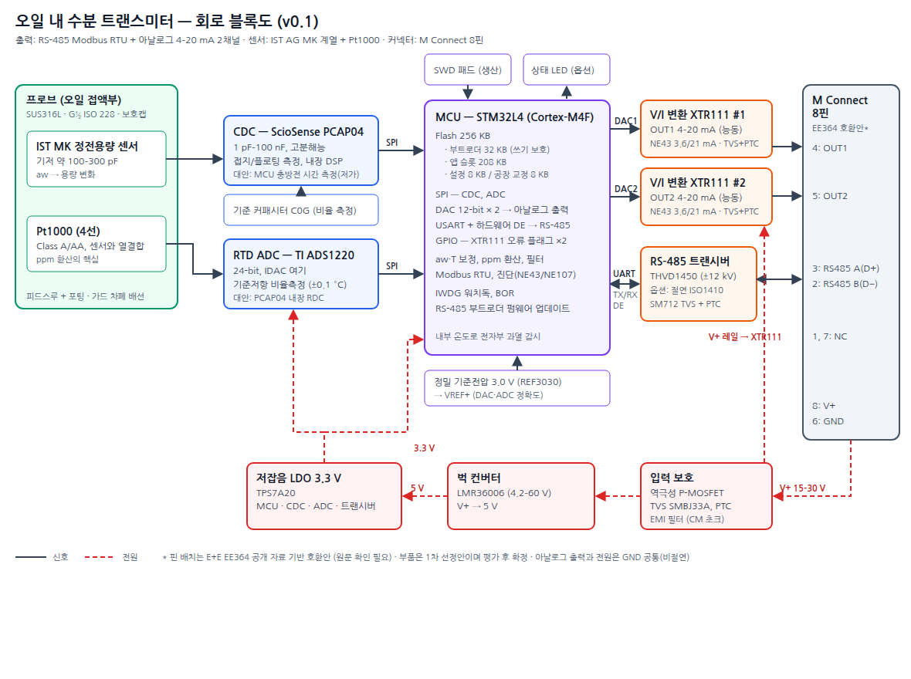

# 하드웨어 블록 설계 v0.2

작성일: 2026-09-26 · 상태: 1차 부품 선정안 (평가보드 검증 전)



원본: [block-diagram.svg](block-diagram.svg)

## 0. 확정 사항

| 항목 | 내용 |
|---|---|
| 출력 | **RS-485 Modbus RTU + 아날로그 2채널** (둘 다 기본 탑재). **채널마다 전압/전류를 설정으로 선택** (2026-09-26 확정) |
| 센서 | IST AG MK 계열 정전용량 소자 (공급 중) + Pt1000 |
| 커넥터 | M Connect 8핀 (핀 배치는 EE364 호환안, 3절) |
| 펌웨어 업데이트 | RS-485 부트로더 ([설계 문서](../rs485-bootloader-design.md)) |
| 전원 | 15–30 V DC, 4선식(전원과 출력 GND 공통, 비절연) |

## 1. 블록별 설계

### 1.1 센서 측정 — 정전용량

| 후보 | 판단 |
|---|---|
| **ScioSense PCAP04 (1순위)** | 1 pF–100 nF 범위를 직접 측정하므로 기저 100–300 pF 소자에 그대로 연결됩니다. 여러 포트가 있어 **C0G 기준 커패시터와 비율 측정**을 할 수 있고, 이 방식으로 온도·전원 드리프트를 제거합니다. 내장 DSP와 저전력도 장점입니다 |
| ADI AD7745/AD7746 | **부적합.** 입력 범위가 ±4 pF이고 오프셋 보상(CAPDAC)도 약 17 pF까지라 수백 pF 소자를 직접 잴 수 없습니다 |
| TI FDC1004/FDC2214 | FDC1004는 오프셋 보상 한계가 있고, FDC2214는 LC 공진 방식이라 인덕터와 온도 특성 관리가 추가로 필요합니다 |
| MCU 충방전 시간 측정 | 원가는 가장 낮지만 분해능과 온도 안정성 확보에 개발 공수가 큽니다. 저가 파생 모델용으로 검토합니다 |

- 배선: 소자에서 피드스루를 지나 PCB까지 **최단 거리**로 연결하고 가드(차폐) 배선을 씁니다. PCAP04는 피드스루 바로 옆에 둡니다.
- 기준 커패시터: C0G/NP0 계열, 소자 기저 용량과 비슷한 값(예: 220 pF, 1%)을 씁니다.

### 1.2 온도 측정 — Pt1000

- **TI ADS1220**: 24-bit ADC이고, 내장 IDAC로 여기 전류를 흘립니다. 기준저항에 대한 비율로 측정하는 4선 결선입니다.
- 목표 정확도는 ±0.1 °C입니다. 60 °C에서 1 °C 오차가 나면 ppm 환산이 약 3% 틀어지므로, **ppm 정확도를 좌우하는 부분**입니다.
- 기준저항은 0.01% / 5 ppm/K 급 정밀 저항을 씁니다.
- 원가 절감안: PCAP04에 내장된 저항 측정 기능(RDC)으로 Pt1000도 측정하면 ADS1220을 뺄 수 있습니다. 정확도를 평가한 뒤 결정합니다.

### 1.3 MCU

- **STM32L4 계열** (예: STM32L431/L452, Flash 256 KB, FPU):
  - ppm 환산(지수 연산)에 FPU가 필요합니다.
  - DAC 12-bit 2채널을 내장해 아날로그 출력 2채널을 바로 만들 수 있습니다.
  - USART의 하드웨어 DE 출력으로 RS-485 송수신 전환을 정확하게 처리합니다.
- 플래시 구성: 부트로더 32 KB, 앱 208 KB, 설정 8 KB, 교정 8 KB (부트로더 설계 문서와 동일).
- 워치독(IWDG), 저전압 리셋(BOR)을 쓰고, 내장 온도센서로 전자부 과열을 감시합니다.
- 생산용 SWD 패드를 둡니다. 교정과 펌웨어 기록은 RS-485로도 할 수 있습니다.

### 1.4 아날로그 출력 2채널 (전압/전류 선택형)

**목표:** 채널마다 Modbus 설정으로 전류 또는 전압 범위를 고릅니다. 커넥터 핀은 채널당 1개입니다.

| 모드 | 범위 | 구현 |
|---|---|---|
| 전류 | **4–20 mA**, 0–20 mA | DAC 전류 범위 (알람용으로 0–24 mA 범위를 내부 사용) |
| 전압 | **0–10 V**, 0–5 V | DAC 전압 범위 (10% 초과 범위 지원) |
| 전압 (파생) | 2–10 V, 1–5 V, 0–1 V | 0–10 V / 0–5 V 범위에서 디지털 스케일링 (16-bit라 분해능 충분) |

**부품 선정**

| 후보 | 내용 | 판단 |
|---|---|---|
| **ADI AD5422 (1순위)** / AD5412(12-bit판) | 16-bit 단일 채널. 전류 4–20/0–20/0–24 mA, 전압 0–5/0–10/±5/±10 V(10% 초과 범위). 내장 기준전압 5 ppm/°C, 총 오차(TUE) 0.1% 수준. 단일 전원 동작. **AN-1313에 전압·전류 출력을 한 핀으로 합치는 방법이 문서화**되어 있음 | 8핀 커넥터에서 채널당 핀 1개로 V/I 겸용이 가능하므로 채택 |
| TI DAC8760 / DAC7760 | 16/12-bit 단일 채널, 같은 범위, 단일 10–36 V 전원, 영점·이득 교정 레지스터 내장 | **2nd source.** 단일 핀 결합 방법은 데이터시트로 확인 필요 |
| MCU DAC + TI XTR300 | 핀으로 V/I 선택하는 출력 드라이버(최대 40 V), 전류 제한과 열 보호 내장 | 원가 절감안. 외장 저항 정밀도와 교정 부담이 큼 |

※ AD5422 공급전압 범위(검색 자료에는 12–48 V로 나옴)는 데이터시트로 확인해야 합니다. 입력 서지 시 AVDD 절대최대정격을 넘지 않도록 입력 보호(1.6절)를 설계합니다.

**설계 포인트**

- **단일 핀 결합:** AD5422의 VOUT와 IOUT를 AN-1313 방식으로 한 단자에 연결합니다. 모드를 바꿀 때는 출력을 먼저 끄고, 범위를 바꾼 다음 다시 켭니다(글리치 방지).
- **부하 조건 (데이터시트 확인 필요)**
  - 전류 모드: 전원 15 V 이상에서 **≤500 Ω**
  - 전압 모드: **≥1 kΩ**, 단락 시 전류 제한
- **알람 출력**
  - 전류 모드: NAMUR NE43 기준으로 센서 이상 시 ≤3.6 mA 또는 ≥21 mA
  - 전압 모드: 이상 시 0 V 또는 +10% 초과(예: 11 V) 중 설정
- **진단:** AD5422의 FAULT 출력과 상태 레지스터로 전류 모드 단선, 과열, 전압 모드 과부하를 감지하고 Modbus 상태로 보고합니다.
- **전압 모드 정확도와 GND:** 전원 전류가 흐르는 GND 선의 전압강하가 전압 출력 오차가 됩니다(예: 케이블 10 m, 50 mA에서 수 mV). 이를 피하려고 **7번 핀을 아날로그 전용 GND(AGND)로 쓰는 것을 제안**합니다.
  - EE364에서 7번 핀은 NC이므로, 7번이 연결되지 않은 기존 케이블에서도 동작합니다. 내부에서 GND와 한 점으로 연결하기 때문입니다.
- **교정:** 생산 공정에서 채널마다 **4–20 mA와 0–10 V 두 범위를 각각 2점 교정**하고, 교정 영역에 저장합니다. 나머지 범위는 같은 하드웨어 범위의 교정값을 씁니다.
- **보호:** 오결선으로 30 V가 들어오는 경우에 대비해 출력마다 TVS, 직렬 PTC, 역전류 차단을 둡니다. 보호 소자의 누설과 직렬저항은 전압 모드 정확도 예산에 포함합니다.
- 출력 설정용 Modbus 레지스터는 [부트로더 설계 문서](../rs485-bootloader-design.md) 7절에 있습니다.

### 1.5 RS-485

- 기본: **TI THVD1450** (3.3 V, ±12 kV ESD, 페일세이프 내장). 버스 TVS는 SM712(비대칭 −7/+12 V용), 직렬로 PTC를 둡니다.
- 옵션: 절연형 **ISO1410** + 절연 DC/DC. 접지 전위차가 큰 현장(변전소 등)용입니다.
- 종단저항 120 Ω은 **내장하지 않습니다**. 버스 끝단에 외부로 설치합니다.
- 방향 전환은 USART의 하드웨어 DE 출력으로 합니다. 기본값 19200 bps 8E1, 주소 1.

### 1.6 전원

```
V+ (15–30 V) → 입력 보호 → ┬→ V+ 레일 → AD5422 ×2 AVDD (출력 전원)
                           └→ 벅 컨버터 LMR36006 → 5 V → 저잡음 LDO TPS7A20 → 3.3 V
```

- 입력 보호: 역극성 차단 P-MOSFET, TVS SMBJ33A, PTC, EMI 필터(코몬모드 초크 + 커패시터).
- 벅 컨버터를 거쳐 LDO를 쓰는 이유: 스위칭 잡음이 CDC와 ADC로 들어가지 않게 하기 위해서입니다.
- 측정하는 순간에는 벅 컨버터를 PFM 모드로 두거나, 측정 타이밍을 동기화하는 방안을 검토합니다.

**소비전력 추정 (24 V 기준, 평가 전 추정)**

| 부분 | 전류 |
|---|---|
| 3.3 V 계통 (MCU, CDC, ADC, 트랜시버 대기, REF) | 약 10 mA → 24 V 환산 약 2 mA |
| RS-485 송신 중 (54 Ω 버스) | 순간 약 60 mA @3.3 V (짧은 구간) |
| 아날로그 출력 2채널 | 최대 2 × 24 mA + AD5422 대기 전류 (데이터시트 확인) |
| **합계** | **최대 약 55 mA @24 V (약 1.3 W)** |

### 1.7 보호와 EMC

- 모든 외부 핀에 TVS와 직렬 PTC 또는 저항을 둡니다.
- 커넥터 쉘과 하우징(SUS)은 차폐 케이블을 거쳐 접지합니다. 하우징과 회로 GND 사이에는 RC(1 MΩ ∥ 4.7 nF) 결합을 둡니다.
- 목표 규격: IEC 61326-1 산업 환경. ESD ±8 kV 접촉, 서지 ±1 kV(라인-접지), 버스트 ±2 kV.

## 2. PCB 구성 (원통 하우징)

- **2단 원형 보드**를 권장합니다.
  - 측정 보드: PCAP04, ADS1220, 기준소자. 피드스루 바로 위에 둡니다.
  - 전원·출력 보드: 입력 보호, 벅, LDO, AD5422 ×2, RS-485, 커넥터 쪽.
  - MCU는 둘 중 한쪽에 둡니다.
- 아날로그 GND와 출력 전류 경로를 분리하고 한 점에서 연결합니다. 출력 전류가 측정 GND를 흐르지 않게 하기 위해서입니다.
- 열: 전류 모드에서 부하가 작을 때 AD5422 발열이 커집니다(최대 약 30 V × 24 mA ≈ 0.7 W/채널). 측정부에 전달되지 않게 전원 보드에 두고 하우징으로 열을 뺍니다. 필요하면 외장 방열 트랜지스터 구성(데이터시트 참고)을 씁니다.

## 3. 커넥터 핀 배치 (EE364 호환안)

| 핀 | 신호 | 비고 |
|---|---|---|
| 1 | NC | |
| 2 | RS485 B (D−) | E+E 표기 기준 |
| 3 | RS485 A (D+) | E+E 표기 기준 |
| 4 | OUT1 (전압/전류 선택) | |
| 5 | OUT2 (전압/전류 선택) | |
| 6 | GND | 전원, 아날로그 출력, RS-485 공통 |
| 7 | **AGND (제안)** | 전압 출력 기준 GND. 내부에서 GND와 한 점 연결. 미연결 시에도 동작(EE364는 NC) |
| 8 | V+ (15–30 V DC) | |

> EE364 핀맵은 공개 자료 인용으로, 원문을 확인하지 못했습니다. M Connect 품번(코딩, 핀 번호 규칙)을 확인하고, 호환 채택 여부를 결정한 뒤 확정합니다. **RS-485의 A/B는 이름이 아니라 +/− 극성으로 표기**합니다.

## 4. 전자부 BOM 개략 (1k 수량, USD, 미견적)

| 부품 | 개략 단가 |
|---|---|
| STM32L4 (256 KB) | 2.5 |
| PCAP04 | 4–6 |
| ADS1220 | 3 |
| AD5422 × 2 (또는 DAC8760 × 2) | 16–24 |
| THVD1450 + SM712 | 1.5 |
| LMR36006 + TPS7A20 | 2 |
| 보호 소자, EMI 필터 | 2 |
| Pt1000, 기준 C/R | 2 |
| PCB 2장, 수동소자 | 4 |
| **전자부 소계** | **약 $37–48** |

별도 항목: IST MK 센서(공급가), M Connect 커넥터, SUS 하우징·프로브 가공, 조립·교정 공수.

## 5. 다음 단계

1. 평가보드 제작: PCAP04와 ADS1220 평가 킷에 MK 센서와 Pt1000을 연결해 분해능과 온도 드리프트를 확인하고, aw 교정 곡선을 확보합니다.
2. AD5422 평가보드(EVAL-AD5422)로 V/I 단일 핀 결합, 모드 전환 글리치, 부하 범위, 알람 출력, 단선 검출을 검증합니다. 원가가 중요하면 DAC7760(12-bit)이나 XTR300 방식과 비교합니다.
3. M Connect 품번과 핀 배치를 확정하고, EE364 호환 여부를 결정합니다.
4. 1차 회로도를 작성하고, 원형 PCB 외형과 하우징 치수를 기구 설계와 맞춥니다.
5. EMC 사전 시험 계획을 세웁니다(IEC 61326-1).
