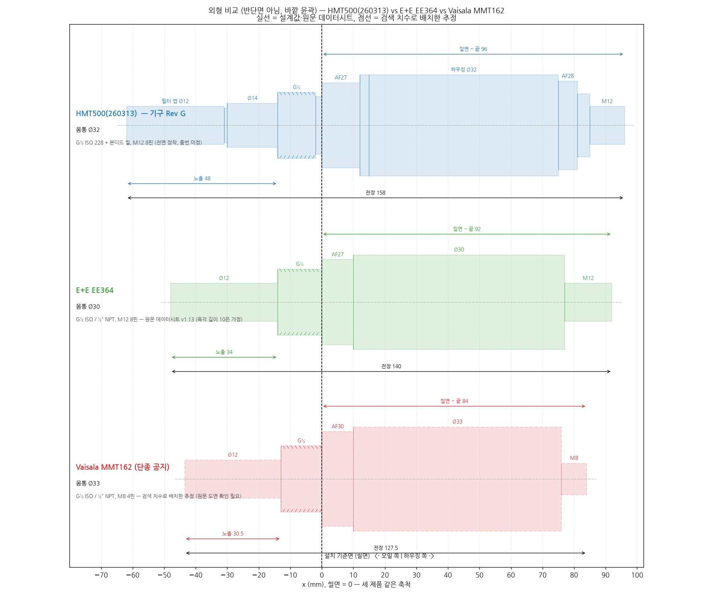

# 외형·장착 방식 비교 — HMT500(260313) vs Vaisala · E+E

작성 2026-09-30 · 우리 제품 = 기구 Rev G (`hardware/mech/hmt500_params.py`에서 계산)

> **자료 출처와 신뢰도:** E+E EE364는 사용자가 준 원문 데이터시트 v1.13(`docs/reference/ee364-summary.md`)입니다. Vaisala MMT162·MMP8과 E+E EE381은 웹 검색으로 본 데이터시트 요약이며, 제조사 PDF 원문은 이 작업 환경에서 열리지 않았습니다. **(확인 필요)** 값은 원문으로 다시 확인해야 합니다. 찾지 못한 값은 "–"로 두었습니다.

## 0. 외형 비교 도면

같은 축척, 설치 기준면(씰면) 정렬. 실선은 설계값·원문 데이터시트, 점선(MMT162)은 검색 치수로 배치한 추정입니다. EE364·MMT162의 육각 길이는 10으로 가정했습니다. 생성: `python docs/market/make_outline_comparison.py`

## 1. 한 줄 비교

| | **HMT500(260313)** | E+E **EE364** | Vaisala **MMT162** | Vaisala **MMP8** | E+E **EE381** |
|---|---|---|---|---|---|
| 형태 | 일체형 봉 모양 트랜스미터 | 일체형 봉 모양 트랜스미터 | 일체형 소형 트랜스미터 (OEM) | 삽입 깊이 조절형 프로브 + 케이블 | 다이캐스트 하우징 트랜스미터 |
| 상태 | 개발 중 | 판매 중 | **단종 공지** (확인 필요) | 판매 중 (MMT162 후속 계열) | 판매 중 |

## 2. 외형 치수 (mm)

| 항목 | **HMT500** | **EE364** (G½) | **MMT162** (G½) | **MMP8** | **EE381** |
|---|---|---|---|---|---|
| 전장 | **158** | 140 | 127.5 (확인 필요) | 프로브 262 / 448 + 케이블 | – |
| 몸통 외경 | **Ø32** (하우징) | Ø30 | Ø33 (확인 필요) | Ø12 프로브 | 사각 다이캐스트 |
| 프로브 외경 | **Ø12** (필터 캡) / Ø14 (바디 튜브) | Ø12 | – | Ø12 | Ø12 |
| 노출 프로브 (끝 ~ 나사 시작) | **48** | 34 | – | 삽입 깊이 35–193 / 35–379 조절 | – |
| 씰면 ~ 커넥터 끝 | **96** (하우징 끝 81 + 커넥터 15) | 92 (하우징 끝 77 + 커넥터 15) | – | – (케이블) | – |
| 설치 육각 | **AF27** (+ 엔드캡 AF28) | AF27 | AF30 (확인 필요) | 피팅 바디 | AF27 또는 AF24 |
| 무게 | 약 **340 g** 추정 (금속 296 g + 몰딩·전자부) | – | 200 g | 510 g / 610 g (케이블 2 m 포함) | – |

## 3. 장착·연결

| 항목 | **HMT500** | **EE364** | **MMT162** | **MMP8** | **EE381** |
|---|---|---|---|---|---|
| 공정 연결 | **G½-A (ISO 228-1)** + 본디드 씰 | G½ ISO / ½" NPT | G½ ISO / ½" NPT | ISO ½" / NPT ½" 피팅 (볼밸브 설치 가능) | G½ ISO / ½" NPT |
| 장착 방식 | 나사 체결, 육각 AF27로 조임. 프로브 고정 깊이 | 나사 체결, 고정 깊이 | 나사 체결, 고정 깊이 | 피팅에서 **삽입 깊이 조절**. 공정 중 탈착 가능 (볼밸브) | 나사 체결, **앞부분 회전** 가능 |
| 전기 연결 | **M12 8핀** (수컷, 전면 장착 — 품번 확정 전) | M12×1 8핀 | **M8 4핀** | M12 5핀 A-코딩 (케이블 일체) | 케이블 글랜드 / 단자 (확인 필요) |
| 커넥터 방향 | 축 방향 (뒤) | 축 방향 (뒤) | 축 방향 (뒤) | 케이블 끝 | 하우징 측면 |
| 하우징 재질 | **SUS316L** (시제품 SUS304) | SUS 1.4404 (316L) | 316L (금속형) / 플라스틱형 있음 | 316L, 케이블 FEP | 알루미늄 다이캐스트 |
| 보호 등급 | IP67 목표 (내부 전체 에폭시 몰딩, 시험 전) | IP65 | IP66 | IP66 | IP65 |
| 센서 교체 | **센서 프로브 교체형** (HTX99R 소켓에 꽂음, 필터 캡만 풀면 됨) | 교체 불가 (필터만 교체) | 교체 불가 | 프로브 단위 교체 | 교체 불가 |

## 4. 사용 조건·전기

| 항목 | **HMT500** | **EE364** | **MMT162** | **MMP8** | **EE381** |
|---|---|---|---|---|---|
| 압력 | 정격 **50 bar** (시험 75 bar), 200 bar형 별도 검토 | 0–20 bar | 최대 200 bar (금속형) | 0–40 bar abs | 20 bar / 100 bar |
| 오일 온도 | −40~120 °C 목표 (JST 커넥터 온도 시험 필요) | −40~80 °C (옵션 100) | −40~80 °C | 헤드 −40~180 °C, 몸체 −40~80 °C | −40~120 °C |
| 전원 | **12–28 V DC** | 10–28 V DC | 14–28 V (RS-485), 22–28 V (전류 출력) | 15–30 V DC | – |
| 출력 | **4–20 mA × 2 + RS-485 Modbus RTU** | 4–20 mA × 2 (3선) + RS-485 Modbus RTU | 아날로그 × 2 + RS-485 | RS-485 Modbus RTU만 (아날로그는 Indigo 변환기로) | 아날로그 × 2, 스위치, LCD 옵션 |
| 측정량 | aw, T, ppm | aw, T, ppm | aw, T, ppm (변압기유) | aw, %RS, T, ppm | aw, T, ppm |

## 5. 차이 요약

1. **설치 호환성:** 공정 연결(G½)과 육각(AF27), 프로브 Ø12는 EE364와 같습니다. 같은 자리에 그대로 달 수 있습니다. MMT162와도 G½로 호환되지만, MMT162는 M8 4핀이라 배선을 바꿔야 합니다.
2. **크기:** EE364보다 **전장 +18 mm**, **외경 +2 mm**입니다. 노출 프로브는 +14 mm인데, 교체형 센서 커넥터(HTX99R)와 필터를 넣으면서 길어졌습니다. 설치 배관 안쪽 깊이를 확인해야 합니다(최소 48 mm 이상 들어갈 공간).
3. **내압·온도:** 50 bar, 120 °C는 EE364(20 bar, 80 °C)보다 높고, MMT162(200 bar)와 MMP8(180 °C 헤드)보다는 낮습니다.
4. **차별점:** 센서 프로브를 현장에서 교체할 수 있습니다(필터 캡 → 프로브). 턴버클 구조라 조립할 때 커넥터 방향이 돌아가지 않고, 내부 전체를 몰딩해 진동·습기에 강합니다.
5. **약점·확인할 것:** 전장 158 mm(EE364보다 김), 무게(추정), IP67은 시험 전, M12 커넥터 품번 미정.

## 출처

- E+E EE364 원문 데이터시트 v1.13 요약: `docs/reference/ee364-summary.md`
- Vaisala MMT162: [datasheet (Vaisala docs)](https://docs.vaisala.com/api/khub/documents/YSymU_tZFpXIeT7iCO4lPQ/content), [datasheet B210755EN](https://www.enr.com/ext/resources/custom-content/Infocenter/2017/Vaisala/CEN-G-MMT162-Datasheet-B210755EN-1.pdf), [iag.co.at MMT162 2022](https://www.iag.co.at/fileadmin/user_upload/MMT162.en_2022.pdf)
- Vaisala MMP8: [datasheet B211795EN-E](https://docs.vaisala.com/api/khub/documents/xqzpNv8Ulq2jC17re2vk1Q/content), [product page](https://www.vaisala.com/en/products/instruments-sensors-and-other-measurement-devices/instruments-industrial-measurements/mmp8), [spec sheet (Kenelec)](https://www.kenelec.com.au/wp-content/uploads/2022/05/Vaisala-MMP8-Moisture-in-Oil-Probe-SpecSheet-revB-2021.pdf)
- E+E EE381: [datasheet](https://www.epluse.com/fileadmin/data/product/ee381/datasheet_EE381.pdf), [DirectIndustry](https://www.directindustry.com/prod/e-e-elektronik/product-13965-1251115.html)
- 경쟁 제품 조사: `docs/market/02-competitors.md`
