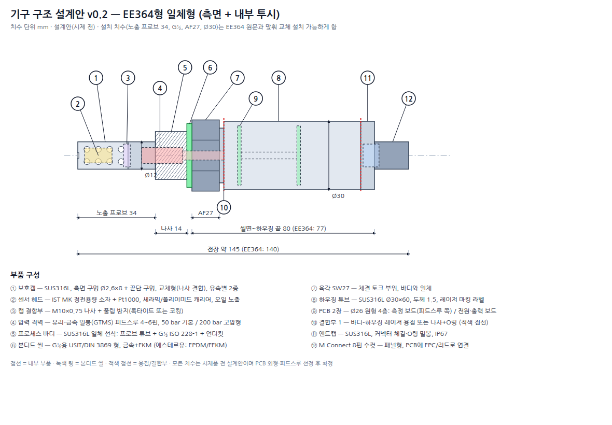

# 기구 설계안 v0.2 — HMT500 (EE364형 일체형)

작성일: 2026-09-26 · 상태: 개념 설계 (시제품 전, 치수는 설계안)

> **Rev E 제작 도면·3D CAD (2026-09-29):** [hardware/mech](../../hardware/mech/README.md)
> — 조립도·부품도 PDF(A3 4장), STEP(조립품·가공부품 6종), 렌더.
> 이 개념안(v0.2)에서 달라진 점:
> - 바디–하우징, 하우징–엔드캡은 **M28×1 나사 + 반경 O링(25×2 FKM)** 으로 결합합니다. 4.6절의 "양산 레이저 용접"은 쓰지 않고, 용접은 피드스루 한 곳만 남깁니다.
> - 하우징 외경은 **Ø32**입니다. Ø30이면 나사와 O링 자리의 벽 두께가 부족합니다.
> - 전장 144 mm로, 씰면에서 엔드캡 끝까지 81 mm, 커넥터 끝까지 96 mm입니다.
> - 커넥터는 엔드캡 M16×1.5 구멍에 **바깥에서** 장착해 리드선이 꼬이지 않게 합니다. 엔드캡은 평면 AF28로 잡고 체결합니다.
> - 보호캡 나사는 M10×0.75입니다.
> - **Rev D/E:** 센서 접속은 두텍 HTX99R 센서 커넥터(4핀, M10×0.75 나사 2곳)입니다. 교체형 센서 프로브를 꽂고, 커넥터는 바디 암나사에 체결합니다. 보호캡(**Ø12**)은 커넥터 위 나사에 체결하고, 바디 튜브는 Ø14입니다. 피드스루는 바디 뒤쪽으로 옮겼습니다.
> - **센서–PCB 연결:** HTX99R 뒤 핀에서 PCB까지 **하네스 W-1 + JST SH 1.0 mm 4핀**(J3 SM04B-SRSS-TB, 옆 삽입)으로 직결합니다. PCB를 플러그만 뽑아 분리할 수 있습니다(결정 #16).
> - **내부 몰딩·턴버클 (결정 #20):** 하우징 안 전체를 상온경화 에폭시 1종으로 몰딩하고(엔드캡 M3 주입·공기 구멍), 엔드캡은 M28×1 왼나사로 바꿔 하우징만 돌려 체결합니다(턴버클). 하네스가 꼬이지 않습니다.
> - **Rev F (결정 #17):** 보호캡은 두텍 **SUS 오일 필터 390000-001100**(Ø12 × 32, M10×1.0)을 씁니다. **피드스루를 없앴습니다.** 바디 Ø7 통로는 관통이고 하네스만 지나가며, 통로(pass-through)는 케이블을 넣은 뒤 에폭시로 몰딩(1차 격벽)하고, 압력 격벽은 HTX99R 커넥터(O링 + 몰드 핀) + 에폭시입니다. M12 커넥터도 하네스 W-2 + JST GH 8핀(J1)으로 PCB에 연결합니다(결정 #18). 노출 프로브 48 mm, 전장 158 mm. 아래 3~5절의 피드스루 관련 내용은 초기 검토안입니다.
> - 전자부는 원형 PCB 2장 대신 **축 방향 긴 PCB 1장(57 × 23)** 입니다. 앞쪽은 바디에 나사로 고정한 수지 홀더에, 뒤쪽은 지지링에 끼웁니다(Rev C).

**견적용 자료:** [HMT500 기구설계 견적 요청서 (PDF)](HMT500_RFQ.pdf) · [도면 HMT500-M-000 (PDF)](HMT500-M-000.pdf)

원본: [assembly.svg](assembly.svg) · 생성 스크립트: [make_drawing.py](make_drawing.py) (치수를 바꾸면 다시 실행)

---

## 1. 목표와 전제

| 항목 | 목표 | 근거 |
|---|---|---|
| 형태 | 보호캡 → 프로브 → G½ 나사 → 본디드 씰 → 육각 → 원통 하우징 → 커넥터 일체형 | 구조 참고: E+E EE364 (두텍 제품 아님) |
| 공정 연결 | **G½ ISO 228-1** + 본디드 씰 (옵션: ½" NPT) | EE364, 경쟁 제품 공통 |
| 압력 | **50 bar 기본 / 200 bar 고압형** | 경쟁 조사: EE364 20 bar는 약함, HYDAC·ifm 50 bar, Vaisala 200 bar |
| 오일 온도 | **−40 ~ +120 °C** | EE364 80 °C보다 높게 |
| 보호 등급 | IP67 (커넥터 체결 상태) | |
| 접액부 재질 | SUS316L | |
| 센서 | IST MK 계열 + Pt1000 | 공급 중 |
| 커넥터 | M Connect 8핀 | 결정 사항 |
| 전자부 | 원형 PCB 2장(Ø26) | [하드웨어 설계](../hw/hardware-block-design.md) |

## 2. EE364 원문 치수 (데이터시트 v1.13)

사용자가 제공한 데이터시트 원문 치수입니다. 상세 내용은 [EE364 원문 요약](../reference/ee364-summary.md)에 있습니다.

| 부위 | EE364 (G½ ISO형) | 우리 설계안 v0.2 | 비고 |
|---|---|---|---|
| 노출 프로브 (끝 ~ 나사 시작) | 34, Ø12 | **34, Ø12** | 같은 삽입 깊이로 교체 설치 가능 |
| 나사 | G½, 14 | **G½ ISO 228-1, 14** | |
| 육각 | AF27 | **AF27 × 12** | 같은 공구 |
| 씰면 ~ 하우징 끝 | 77 | **80** | 압력 격벽(GTMS)과 PCB 2장 공간 확보 |
| 씰면 ~ 커넥터 끝 | 92 | **95** | |
| 하우징 외경 | Ø30 | **Ø30** | |
| 전장 | 140 | **약 145** | |
| 압력 / 오일 온도 / IP | 20 bar / 100 °C(옵션) / IP65 | **50·200 bar / 120 °C / IP67** | 사양 우위 |
| 재질 | 316L (1.4404) | 316L | |

→ **설치 치수(삽입 깊이, 나사, 육각, 외경)를 EE364와 같게** 두어 기존 설치 위치에 그대로 교체할 수 있게 했습니다. 뒤쪽 길이는 약 3 mm 더 깁니다.

## 3. 설계안 치수 (구조도 기준)

| 번호 | 부품 | 치수 / 사양 |
|---|---|---|
| ① | 보호캡 | Ø12 × 22, 측면 구멍 Ø2.6 × 8 + 끝단 구멍. **나사로 결합하는 교체형**. EE364처럼 유속별 2종(< 1 m/s, > 1 m/s), 옵션으로 소결 필터 |
| ② | 센서 헤드 | MK 소자 + Pt1000을 한 캐리어에 실장 (약 12 × Ø6.5 공간). 오일에 직접 노출 |
| ③ | 캡 결합부 | M10×1.0 (가는 나사) + 풀림 방지 — Rev G 확정 |
| ④ | 압력 격벽 | 프로브 튜브에서 나사 구간까지. 4~6핀 피드스루 |
| ⑤ | 프로세스 바디 | SUS316L 일체 선삭: 프로브 튜브(Ø12) + G½ 나사(14) + 언더컷 |
| ⑥ | 본디드 씰 | G½용 (내경 약 21.5, 외경 약 28.7) |
| ⑦ | 육각 | AF27 × 12, 바디와 일체 |
| ⑧ | 하우징 | Ø30 × 60, 두께 1.5 → 내경 27. PCB Ø26 수납 |
| ⑨ | PCB | Ø26 원형 4층 2장, 간격 약 25 |
| ⑩ | 바디–하우징 결합 | 4.6절 참고 |
| ⑪ | 엔드캡 | Ø30 × 6, 커넥터 체결, O링 |
| ⑫ | M Connect 8핀 | 패널형 수컷, 돌출 약 15. 핀맵은 EE364와 동일(원문 확인) |
| | **전장** | **약 145** |

## 4. 핵심 설계 이슈

### 4.1 압력 격벽 — 가장 중요

오일 압력(50~200 bar)을 받는 쪽(센서 헤드)과 전자부를 **완전히 분리하는 격벽**이 있어야 합니다. 격벽이 새면 오일이 하우징 안으로 들어가 전자부가 고장 납니다.

| 방식 | 장점 | 단점 | 판단 |
|---|---|---|---|
| **유리-금속 밀봉(GTMS) 피드스루** | 200 bar 이상, 고온, 헬륨 리크 수준 기밀. 산업 표준 | 부품 단가가 높고(수~십수 달러), 리드타임과 용접이 필요 | **기본안** (특히 200 bar형) |
| 에폭시 포팅 + 백업 링 | 저렴하고 공정이 단순 | 온도 사이클에서 박리 위험, 장기 기밀 불확실 | 50 bar 저가형에 한해 검토, 반드시 시험 검증 |
| 세라믹 기판 브레이징 | 소형, 고신뢰 | 전문 협력사 필요 | 대안 |

- 피드스루는 바디에 **레이저 용접 또는 압입 + 용접**으로 고정합니다.
- 핀 수: MK 소자 2 + Pt1000 4선 = 6핀. 3선으로 줄이면 5핀. 가드 차폐를 쓰면 +1핀.
- 피드스루 바로 뒤에 측정 보드(PCAP04)를 두어 배선을 최단으로 합니다.

### 4.2 센서 헤드 고정

- MK 소자와 Pt1000을 작은 캐리어(세라믹 또는 폴리이미드 FPC)에 붙이고, 피드스루 핀에 용접이나 납땜으로 연결합니다.
- 오일 흐름과 진동에 견디도록 캐리어를 고정합니다. 소자 표면(감지막)은 막지 않습니다.
- 소자 사이의 열결합을 위해 Pt1000을 MK 소자 바로 옆에 둡니다(ppm 환산 정확도).
- **필요 자료: 공급받는 MK 소자의 외형 도면과 리드 형태.**

### 4.3 보호캡

- 역할: 유속과 이물질로부터 소자를 보호하되, 오일은 원활하게 교환되게 합니다(응답시간).
- 구멍 총면적과 응답시간 T63을 시험해서 정합니다. 기본안은 Ø2.6 × 8개 + 끝단 구멍입니다.
- 교체형 캡 옵션: 소결 필터(40 µm급)를 넣은 캡은 오염이 심한 유압유용입니다.

### 4.4 밀봉과 씰 재질

| 위치 | 씰 | 재질 |
|---|---|---|
| 공정 연결 (G½) | 본디드 씰 | 금속 + **FKM** (기본), 에스테르유·인산에스테르 유압유는 EPDM 또는 FFKM |
| 하우징 결합부 (나사식일 때) | O링 | FKM 또는 NBR (오일 비접촉) |
| 엔드캡 / 커넥터 | O링, 커넥터 자체 씰 | FKM 또는 NBR |

- 씰 재질은 **대상 오일과의 호환성 표**를 만들어 주문 옵션으로 둡니다.

### 4.5 열 관리

- 오일 120 °C에서 전자부는 85 °C 이하로 유지해야 합니다(부품 정격).
- 열 경로: 오일 → 바디(나사, 육각) → 넥 → 하우징 → 주위 공기.
- 넥(육각과 하우징 사이 얇은 부분)과 하우징 표면적으로 열을 뺍니다. 필요하면 **확장 넥 옵션**(+30~50 mm)을 둡니다.
- 전자부 발열(아날로그 출력 최대 약 1.4 W)도 더해지므로 **열해석 또는 열시험이 필요**합니다.

### 4.6 바디–하우징 결합 (⑩)

| 방식 | 장점 | 단점 |
|---|---|---|
| 나사 + O링 | 분해·수리가 가능하고 시제에 유리 | 풀림 방지 필요, 부피 약간 증가 |
| **레이저 용접** | 밀봉·강성 우수, 외관이 깔끔(EE364와 비슷) | 분해 불가, 용접 설비·협력사 필요 |

→ ~~시제품은 나사 + O링, 양산은 레이저 용접~~ → **Rev B: 시제품과 양산 모두 나사(M28×1) + 반경 O링**으로 확정했습니다. 수리할 수 있고 용접 설비가 필요 없습니다.

### 4.7 EMC와 접지

- 하우징(SUS)을 커넥터 쉘과 연결하고, 차폐 케이블로 현장 접지에 연결합니다.
- PCB GND와 하우징은 RC(1 MΩ ∥ 4.7 nF)로 결합합니다(하드웨어 설계 1.7절).

## 5. 조립 순서 (안)

1. 바디(⑤)에 피드스루(④)를 레이저 용접한 뒤, **헬륨 리크 시험과 내압 시험**을 합니다.
2. 센서 헤드(②)를 피드스루 핀에 연결하고 고정합니다.
3. 보호캡(①)을 체결합니다(나사, 풀림 방지).
4. (Rev F) W-1 플러그를 PCB 홀더 Ø6 구멍에 통과시키고 홀더를 바디에 고정합니다. PCB(⑨)를 홀더에 끼워 고정하고 W-1 플러그를 J3(JST SH 4핀)에 꽂습니다. 뒤쪽에 지지링을 끼웁니다.
5. 하우징(⑧)을 나사로 결합합니다(M28×1 + O링, 나사 고정제).
6. 리드선을 엔드캡(⑪) 구멍에 통과시켜 엔드캡을 체결하고, 커넥터(⑫)를 바깥에서 체결합니다.
7. RS-485로 펌웨어를 기록하고 교정합니다(습도 교정 → 아날로그 출력 교정).
8. 기능 시험, IP67 시험(샘플), 라벨 레이저 마킹을 합니다.

## 6. 시험 항목 (기구)

| 시험 | 조건 (안) |
|---|---|
| 내압 | 정격의 1.5배: 50 bar형 75 bar, 200 bar형 300 bar, 유지 후 누설 없음 |
| 파열 | 정격의 4배 이상 목표 (샘플) |
| 기밀 | 피드스루 헬륨 리크 ≤ 1×10⁻⁸ mbar·l/s (GTMS 기준, 협력사 사양 확인) |
| 압력 사이클 | 유압용: 0 ↔ 정격, 10⁵~10⁶ 회 |
| 방진·방수 | IP67 (IEC 60529) |
| 진동·충격 | IEC 60068-2-6 / -27 |
| 열충격·온도 사이클 | 오일 −40 ↔ 120 °C, 전자부 온도 측정 포함 |
| 체결 | G½ 체결 토크 시험, 씰 재사용성 |

## 7. 기구 원가 개략 (1,000대, 추정)

| 부품 | 추정 단가 |
|---|---|
| 프로세스 바디 (SUS316L 선삭, 나사, 육각) | $8 ~ 15 |
| 하우징 튜브 | $3 ~ 6 |
| 엔드캡 | $2 ~ 4 |
| 보호캡 | $2 ~ 4 |
| 피드스루 (GTMS 5~6핀) | $5 ~ 15 |
| 본디드 씰, O링 | $0.5 ~ 1.5 |
| 레이저 용접, 마킹, 리크 시험 공수 | $3 ~ 8 |
| **기구 합계** | **약 $24 ~ 54** |

전자부(약 $36~64, [bom-cost.md](../hw/bom-cost.md))와 합하면, 센서와 커넥터를 뺀 재료·가공비는 **약 $60~118**입니다. 모두 추정이며, 가공 협력사 견적으로 확정해야 합니다.

## 8. 주의: 지식재산권

- 외형을 EE364와 똑같이 만들면 **디자인권 침해 위험**이 있습니다. E+E의 한국·유럽 디자인 등록 여부를 확인해야 합니다(KIPRIS, EUIPO).
- 설계안에는 차별 요소를 넣었습니다: 교체형 보호캡, 50/200 bar, 120 °C, 하우징 비율과 표면 처리. 하우징에 평면 가공(렌치 면이나 라벨 면)이나 두텍 고유의 외관 요소를 추가하는 것을 권장합니다.
- 기능이 같은 구조(G½, 육각, 원통 하우징, M12)는 업계 공통 형태라 문제가 되지 않을 가능성이 높습니다. 다만 최종 판단은 변리사 확인이 필요합니다.

## 9. 확정에 필요한 자료

1. **IST MK 소자 외형 도면**(리드 형태, 치수, 권장 실장 방법)
2. **M Connect 8핀 품번**(패널 체결 나사, 설치 깊이, PCB 연결 방식)
3. 압력 등급: 50 bar 한 가지로 할지, 50/200 bar 두 가지로 할지
4. 최대 오일 온도: 120 °C로 확정할지, 확장 넥 옵션을 둘지
5. 프로브 길이 옵션: 표준형만 할지, 긴 프로브(예: 100/200 mm, 변압기·탱크용)도 둘지
6. 가능하면 EE364 실물 1대(분해해서 내부 격벽·센서 고정 방식 확인용)
