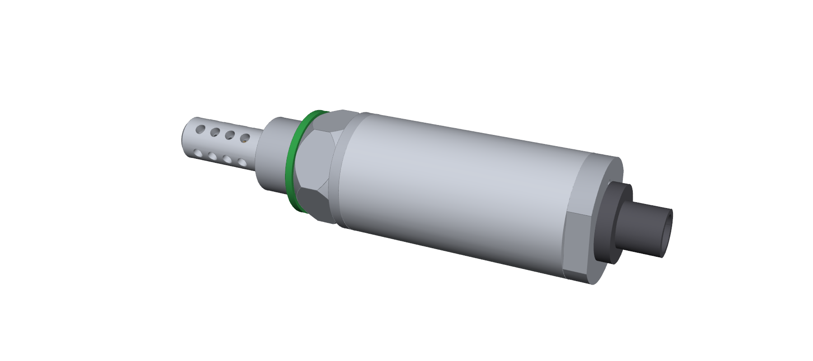
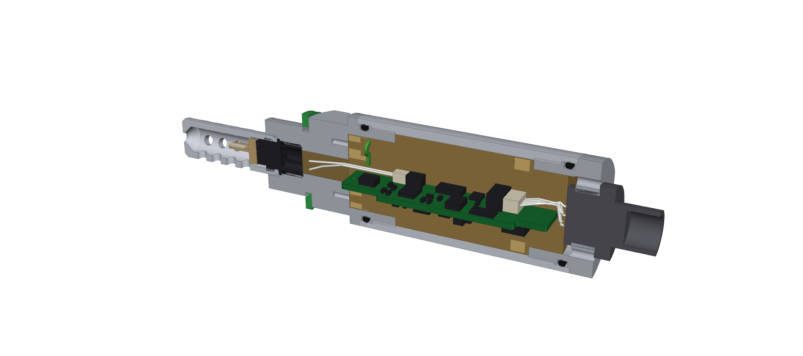
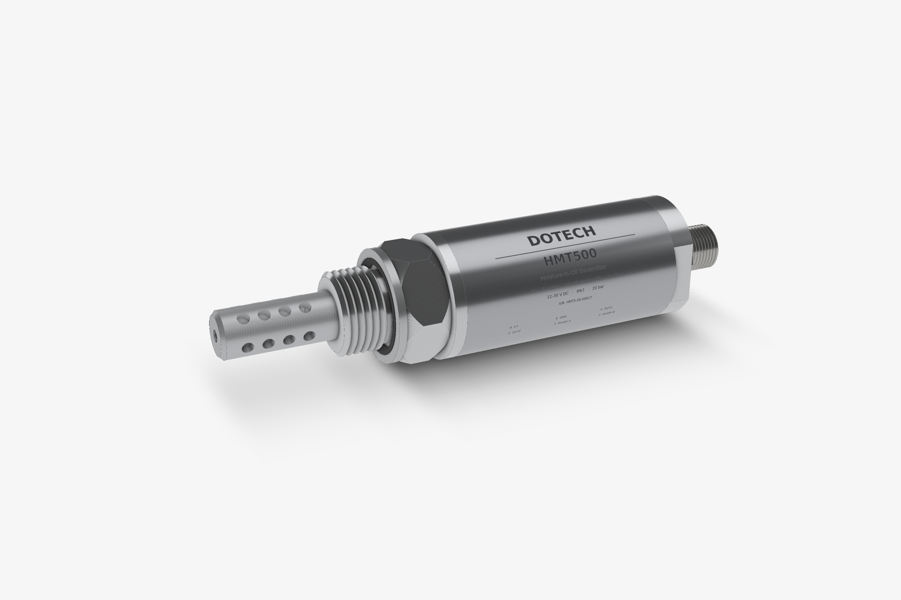

# HMT500(260313) 기구 설계 (Rev G)

**Rev G 보호캡 보호 (2026-09-30, 결정 #29):** 바디 앞 Ø14 튜브를 없애고, 앞부분 전체(커넥터·캡·프로브)를 뒤로 19.5 mm 옮겼습니다. 보호캡 뿌리 **3.5 mm가 G½ 앞면의 Ø12.3 자리 안**에 들어가, 캡이 상하좌우로 젖혀지면서 HTX99R 플라스틱 커넥터가 깨지는 것을 막습니다(틈 0.15, 벽 ≥ 3 mm). 전장 158 → **138.5 mm**, 노출 프로브 48 → **28.5 mm**, Ø7 통로 14.5 mm, W-1 40 mm. 아래 Rev F의 48 / 158 mm는 이전 값입니다.

**Rev G (2026-09-30, 결정 #27) — 조립 시뮬레이션 반영:** 홀더(M-105)에 W-1 플러그 창 5.6 × 3.2와 링 단자 자리 Ø5.2 × 2.2를 냈습니다. PCB 폭 23 구간은 x 63.4에서 끝납니다. 샤시는 J5 스프링 접점 대신 **샤시 선 ⑳**(AWG 28 25 mm + M2 링 단자 → 홀더 위 축 나사 → 바디)으로 연결합니다. W-2는 40 mm로 줄였고, 조립 공구 **T-001 밀대**(`out/HMT500-T-001_push_tool.step`, 3D 프린트)를 추가했습니다. 조립 순서는 조립도 주기 5이며, 검증은 `python assembly_sim.py`로 합니다(`out/assembly_sim/`, 23항목 NG 0).

**내부 몰딩·턴버클 (2026-09-29, 결정 #20):**
- 하우징 안 **전체**(바디 Ø22 + 하우징 Ø27 + 엔드캡 Ø22, 약 25 cm³)를 **상온경화 에폭시 1종**으로 몰딩합니다. Ø7 통로 1차 몰딩과 같은 재료입니다.
  - 엔드캡에 M3 구멍 2개(90°·270°)를 두어 한쪽으로 진공 주입하고, 다른 쪽으로 공기를 뺍니다. 경화 후 M3×3 무두나사와 실런트로 막습니다.
  - 몰딩 후에는 전자부를 고칠 수 없습니다. SWD 기록, 기능 검사, 1차 교정은 몰딩 전에 하고, 최종 교정은 몰딩 경화 뒤에 합니다.
- 엔드캡 나사를 **M28×1 왼나사**로 바꿔 **턴버클**로 체결합니다. 바디(AF27)와 엔드캡(AF28)을 잡고 하우징만 돌리면 양쪽이 동시에 당겨지므로, PCB·M12·하네스가 돌지 않습니다.
- J3를 홀더 뒤 12.5 mm(x 30.5–34.5)로 옮겨 플러그를 꽂을 공간을 만들었습니다. PCAP04와 ADS1220도 옮겼습니다.
- 조립 순서는 조립도 주기 5에 있습니다.

**Rev F (2026-09-29, 결정 #17):** 앞쪽 보호캡을 두텍 필터로 바꾸고 피드스루를 없앴습니다.
- **필터 캡 ②:** 두텍 기존품 **SUS PROBE 오일 필터 390000-001100** (`ref/SUS_PROBE_Oil_Filter_20200608.dwg`, SUS304)입니다.
  - Ø12 × 32, 끝 C1, 열린 끝 Ø11 × 1입니다.
  - **M10×1.0 암나사(깊이 8.5)** 로 HTX99R 커넥터 위 나사에 체결합니다. 열린 끝이 커넥터 플랜지 앞면을 눌러 줍니다.
  - 센서실 Ø8입니다. 측면 Ø3 구멍 20개(끝에서 6·11·16·21 mm, 줄마다 5개 72°)와 끝단 Ø3 구멍이 있습니다.
  - 센서 프로브 플러그는 Ø8.5 → **Ø7.6**으로 줄였습니다.
  - 노출 프로브는 34 → **48 mm**, 전장은 144 → **158 mm**입니다.
- **피드스루 삭제:** 커넥터 뒤부터 PCB까지는 **Ø7 관통 통로**이고 센서 하네스 W-1만 지나갑니다.
  - 통로는 pass-through(케이블만)이고, 케이블을 넣은 뒤 **전 길이(Ø7 × 34)를 에폭시로 몰딩(⑤, 1차 격벽)** 합니다.
  - 압력 격벽은 **HTX99R O링 + 몰드 핀 + 에폭시 몰딩**입니다. HTX99R 내압·누설과 에폭시 재료 확인이 필요합니다(미결).
- **센서 하네스 W-1 (결정 #16):** HTX99R 뒤 핀 4개 → **JST SH 1.0 mm 4핀 플러그 → PCB J3 (SM04B-SRSS-TB, 옆 삽입·직각, 입구 앞쪽)**. PTFE AWG30, 60 mm입니다.
  - J3는 PCB 윗면, 앞 끝에서 8 mm 뒤(x 22.5–26.5)에 있는 **옆 삽입(직각) 헤더**입니다. 입구가 앞쪽(센서 쪽)이라 홀더 구멍에서 나온 전선이 굽힘 없이 곧게 플러그로 들어갑니다. 높이 2.95이고, PCAP04는 J3 바로 뒤입니다.
  - 조립 순서는 다음과 같습니다.
    1. W-1 전선을 커넥터 뒤 핀에 납땜하고 O링을 끼웁니다.
    2. 플러그를 바디 앞에서 Ø7 통로로 넣어 뒤로 뺍니다.
    3. 커넥터를 체결합니다. 플러그가 자유로워 하네스가 같이 돌므로 꼬이지 않습니다.
    4. 프로브를 아래로 세우고 뒤에서 에폭시를 주입해 Ø7 통로를 채우고 경화합니다.
    5. 플러그를 홀더 Ø6 구멍에 통과시키고 홀더를 체결합니다.
    6. PCB를 장착하고 플러그를 J3에 꽂습니다.
  - JST SH의 정격은 −25 ~ +85 °C이므로 PCB 앞 끝 온도를 시험으로 확인해야 합니다(미결).
- **M12 하네스 W-2 (결정 #18):** M12 8핀 커넥터도 **JST GH 1.25 mm 8핀 옆 삽입(직각) 헤더 J1 (SM08B-GHS-TB)** 에 하네스로 연결합니다.
  - J1은 PCB 윗면, 뒤 끝에서 12.5 mm 앞(x 52.5–58.5)에 있고 입구가 뒤쪽(커넥터 쪽)입니다.
  - 플러그 GHR-08V-S, PTFE AWG28 60 mm, 핀 n = M12 핀 n입니다.
  - 조립: 엔드캡을 빈 상태로 체결 → W-2(M12 핀에 미리 납땜) 플러그를 엔드캡 M16 구멍으로 넣어 축 방향으로 J1에 꽂음 → M12 체결. 체결 회전(약 4바퀴)만큼 미리 반대로 꼬아 둡니다(미결: 회전 없는 고정형 검토).
  - M12 쉘로 잇던 샤시는 **J5 스프링 접점**(PCB 가장자리 → 하우징 내면)으로 바꿨습니다.
  - 출력부 배치: DAC#1은 뒤 끝(x 67.5)으로, 입력 TVS는 MCU 옆(x 48.5)으로, TPS26611은 아랫면으로 옮겼습니다.
- **나사 규격 (Rev G 확정):** HTX99R 위·아래 나사는 모두 **M10×1.0**입니다(두텍 확인). 바디 암나사는 M10×1.0-6H, 필터 캡은 M10×1.0입니다.

아래 Rev E 이전 설명 중 피드스루, 보호캡 M-102(자체 가공품), 22 mm 하네스에 관한 내용은 Rev F에서 바뀌었습니다.

DOTECH HMT500 오일 수분 트랜스미터의 3D CAD와 2D 제작 도면입니다. 모든 치수는 `hmt500_params.py` 한 곳에서 관리하고, 여기서 3D 모델과 도면을 함께 생성합니다.

**Rev E (2026-09-29):** 두텍 확인 결과, HTX99R 커넥터의 Ø10 두 곳은 **M10×0.75 나사**입니다(아래는 하우징 체결, 위는 보호캡 체결). 이에 맞춰 다음을 바꿨습니다.
- **커넥터 체결:** 바디 앞 **M10×0.75-6H 암나사**(깊이 8)에 돌려 박습니다. 맞변 7로 잡고 조입니다.
  - O링(8 × 1.2)은 나사와 플랜지 사이 홈에서 Ø10 H8 밀봉면(길이 1.5)에 닿습니다.
  - 플랜지는 Ø11.2 × 1 자리에 앉습니다.
- **보호캡:** 커넥터 **위 나사 M10×0.75**에 체결합니다. 캡 외경은 **Ø12**로 돌아왔습니다(EE364와 같음). 바디 앞 튜브는 플랜지 자리 때문에 **Ø14**입니다.
- **배선 꼬임 방지:** 커넥터를 돌려 박으면 뒤쪽 배선도 같이 돕니다. 그래서 순서를 다음과 같이 잡았습니다.
  1. 커넥터 핀에 선 4가닥을 먼저 납땜하고 포팅합니다.
  2. 선 끝이 자유로운 상태에서 커넥터를 체결합니다. 선은 Ø7 통로로 뒤쪽까지 나옵니다.
  3. 뒤쪽에서 피드스루에 납땜합니다.
- **피드스루 위치:** 피드스루는 **바디 뒤쪽 Ø22 카운터보어 바닥의 Ø8 H7 자리**로 옮겼습니다. 뒤에서 넣고 뒤에서 레이저 용접하므로 접근이 쉽습니다.

**Rev D (2026-09-29):** 센서 접속을 두텍 기존 부품 **HTX99R 센서 커넥터**(4핀, `ref/` STEP)로 바꿨습니다.
- 교체형 **센서 프로브**(IST MK33-W mini + Pt1000 MiniSens, 4핀)를 커넥터 소켓에 꽂고, 보호캡을 씌웁니다.
- **커넥터 고정:** 커넥터는 바디 앞 **Ø10 H8 구멍**에 O링(8 × 1.2 FKM, 커넥터 홈 Ø8.2, 압축률 25 %)으로 밀봉합니다.
  - 플랜지 Ø11은 바디 턱(Ø11.2 × 1)에 걸려 오일 압력을 받습니다.
  - 보호캡 안쪽 턱(Ø10.2)이 플랜지 앞면을 눌러 빠지지 않게 잡습니다.
- **압력 격벽:** 커넥터 뒤 핀은 납땜·포팅 공간(Ø9 × 6)에서 피드스루(Ø8 H7, 압력 격벽)와 짧은 선으로 잇습니다. 커넥터 O링이 1차 밀봉이고, 피드스루가 최종 압력 격벽입니다.
- **치수 변경:** 커넥터 플랜지 Ø11 때문에 **노출 프로브와 보호캡을 Ø12 → Ø16**으로 키웠습니다.
  - 노출 길이 34, G1/2, 전장 144는 그대로입니다.
  - 캡 나사는 M10×0.75 → M14×1입니다.
  - G1/2 설치 구멍(골지름 18.6)은 통과하지만, EE364의 Ø12 프로브와는 외경이 다릅니다.

**Rev C (2026-09-26):** 전자부를 원형 PCB 2장에서 **축 방향 긴 PCB 1장(57 × 23, 4층)** 으로 바꿨습니다.
- PCB는 축을 지나는 평면에 세웁니다. 앞 끝은 수지 홀더(M-105)의 홈에 끼우고 M2 나사 2개로 고정합니다. 홀더는 바디 카운터보어 바닥에 M2 나사 2개로 고정합니다.
- 뒤쪽은 수지 지지링(M-106)의 홈이 받쳐 줍니다. 지지링은 엔드캡과 연결하지 않으므로 하우징·엔드캡을 돌려 체결해도 PCB가 같이 돌지 않습니다.
- 배치는 앞쪽 측정부 → 가운데 MCU·전원 → 뒤쪽 출력·보호 순입니다. 보드 간 커넥터가 없습니다.
- PCB 외곽, 금지 구역, 부품 높이 한계는 도면 4쪽과 KiCad 보드 파일(`hardware/kicad/HMT500(260313A)/HMT500(260313A).kicad_pcb`)에 같은 값으로 들어 있습니다.

**Rev B (2026-09-26):** 바디–하우징, 하우징–엔드캡 결합을 레이저 용접에서 **M28×1 나사 + 반경 O링(25×2 FKM)** 으로 바꿨습니다.
- 나사와 O링 자리의 벽 두께를 확보하려고 하우징 외경을 Ø30에서 **Ø32**로 키웠습니다.
- 용접은 피드스루 한 곳만 남아서 분해와 수리가 가능합니다.
- 커넥터는 엔드캡을 체결한 뒤 바깥에서 끼우는 전면 장착형입니다. 그래서 엔드캡을 돌려 체결해도 리드선이 꼬이지 않습니다.




## 제품 시안 (스튜디오 렌더)

`render_studio.py` → `out/studio/HMT500_studio_01~06.png` (외관 시안: 레이저 마킹 문안·커넥터 외형은 가안)



## 센서 커넥터 HTX99R-SC (두텍 기존 부품)

센서 프로브를 꽂는 커넥터(두텍 HTX99R 모델)의 2D 도면입니다. 원본 STEP은 `ref/HTX99R_Sensor_Probe_Sensor_Connector.STEP`이고, `htx99r_connector_drawing.py`가 모델에서 은선 처리로 투영해 `out/HTX99R-SC_sensor_connector.pdf`를 만듭니다. 도면은 A3 한 장, 5:1이며 정면도·단면 A–A·윗면도·아랫면도·등각도로 되어 있습니다.

- **몸체:** Ø10 × 15, 플랜지 Ø11 × 1, 홈 2개 (Ø8.2 × 1.5, Ø8.1 × 1.5), 양 끝 C0.5.
- **윗면:** 맞변 7 평면 (길이 3). 센서 핀 소켓은 4× Ø1.5, 깊이 7.9, 2.54 격자입니다.
- **아랫면:** Ø7 × 7 오목부가 있고, PCB 핀 4× □0.64가 2.54 격자로 3 mm 돌출합니다.
- **확인 필요:** 재질·공차는 STEP에 없어서 원 도면이나 공급사 사양으로 확인해야 합니다.

## 산출물 (`out/`)

| 파일 | 내용 |
|---|---|
| `HMT500_mechanical_drawings.pdf` | **제작 도면 4장 (A3)**: 조립도 M-000(부품표·주기), 바디 M-101, 보호캡·하우징·엔드캡 M-102~104, PCB 홀더·지지링·PCB 외곽 M-105~106 |
| `HMT500-M-000_assembly.svg` 등 | 도면 원본 SVG |
| `HMT500_assembly.step` | 3D 조립품 (구매품 단순 형상 포함, 색 구분) |
| `HMT500-M-101_body.step` ~ `M-106_ring.step` | 가공 부품별 3D (가공 업체 견적용) |
| `HMT500_render*.png` | 외관 / 절단 렌더 |

## 주요 치수

| 항목 | 값 |
|---|---|
| 전장 | **138.5 mm** (프로브 끝 ~ 커넥터 끝, Rev G 보호캡 묻힘) |
| 노출 프로브 / 공정 나사 | **28.5 mm**, 보호캡 **Ø12**만 노출 (바디 튜브 없음, 캡 뿌리 3.5 mm는 G½ 앞면 Ø12.3 자리 안) / G1/2-A ISO 228-1, 14 mm |
| 육각 / 하우징 | AF27 / Ø32 × 60 (양끝 M28×1-6H, Ø29 H8 O링 보어) |
| 씰면 기준 | 엔드캡 끝 81 mm, 커넥터 끝 96 mm |
| 가공품 질량 (316L) | 바디 113 g, 캡 13 g, 하우징 105 g, 엔드캡 47 g (합계 약 279 g, 전자부·커넥터 제외) |
| 결합부 O링 | 25 × 2 FKM 75, 2개. 압축률 15 %, 늘림 2.4 % (Ø29 H8 / 홈 Ø25.6 h9 × 2.7) |

## 구조 요약

1. **바디(M-101):** G½ 앞면의 보호캡 자리 Ø12.3 × 3.5, 센서 커넥터 자리(Ø11.2 / Ø10 H8 / M10×1.0-6H), Ø7 배선 통로, G1/2 나사, 언더컷, 육각 AF27, Ø32 칼라, Ø29 f7 O링 자리, M28×1 수나사까지 한 덩어리로 선삭합니다.
   - Ø7 통로(길이 14.5)는 Ø22 카운터보어까지 관통합니다(Rev F, 피드스루 없음). 센서 하네스만 지나가고, 전 길이를 에폭시로 몰딩합니다(1차 격벽).
2. **보호캡(M-102):** 나사 결합 교체형이며, 측면 Ø2.6 구멍 8개와 끝단 Ø3 구멍이 있습니다.
3. **하우징(M-103):** Ø32/Ø27 튜브이고, 양 끝에 Ø29 H8 O링 보어(깊이 4)와 M28×1-6H 암나사(길이 7)가 있습니다.
   - 바디와 엔드캡을 나사로 체결하고, 중강도 나사 고정제를 씁니다. 토크는 5 N·m로 잡았으며 확정이 필요합니다.
   - 체결할 때는 바디 육각 AF27과 엔드캡 평면 AF28을 잡고 돌립니다.
4. **엔드캡(M-104):** M28×1 수나사, O링 자리, 평면 AF28 플랜지로 되어 있습니다. M Connect 8핀 커넥터는 플랜지의 M16×1.5 구멍에 **바깥에서** 체결합니다.
5. **전자부(E-301):** 57 × 23 PCB 1장입니다. 폭은 바디·엔드캡 안(Ø22)에서 18, 하우징 안(Ø27)에서 23입니다.
   - 한 면의 부품 높이 한계(여유 0.5 포함)는 가장자리 5.0~5.8 mm, 중심 9.7~12.2 mm입니다.
   - HTX99R 뒤 핀 4개에서 하네스 W-1(JST SH 1.0 mm 4핀, 60 mm)을 앞쪽 J3에, M12 커넥터 8핀에서 하네스 W-2(JST GH 1.25 mm 8핀, 60 mm)를 뒤쪽 J1에 꽂습니다.
6. **PCB 홀더(M-105)와 지지링(M-106):** PEEK(또는 PA66-GF30)입니다. 홀더는 Ø21.6 × 5.8이고 Ø6 하네스 구멍과 1.7 홈이 있습니다. 지지링은 Ø26.4 / Ø20 × 4이고 홈 2곳이 있습니다.

## 다시 만들기

```bash
python3 hardware/mech/hmt500_drawings.py && hardware/mech/make_pdf.sh   # 2D 도면 (추가 설치 불필요)
pip install cadquery                                                    # 3D는 CadQuery 필요
python hardware/mech/hmt500_cad.py                                      # STEP
python hardware/mech/render3d.py                                        # 렌더 (OSMesa/EGL 필요)
```

## 확인·확정이 필요한 항목

- **압력 격벽 (Rev F):** 피드스루가 없으므로 HTX99R 커넥터(몰드 핀·O링)와 에폭시 몰딩의 내압·누설·내열을 확인해야 합니다.
- **커넥터:** M Connect 품번(장착 나사 M16×1.5 가정, 돌출 길이, O링)을 확정해야 합니다.
  - 리드가 달린 커넥터를 돌려 체결하면 리드가 약 4바퀴 꼬입니다(M16×1.5, 나사 6 mm). 리드를 반대로 미리 꼬아 두거나, 뒤쪽 너트 고정형 품번을 고르는 방안을 검토해야 합니다.
- **센서 프로브 (Rev D):** HTX99R용 센서 프로브의 STEP(핀 규격·플러그 형상)을 받아 반영해야 합니다. 지금은 Ø1.0 핀 4개와 PEEK 플러그를 가정했습니다.
- **HTX99R 커넥터:** 재질·내열(120 °C)·내유성, 몰드 핀 주위 누설, 체결 토크를 확인해야 합니다. 나사는 위·아래 모두 M10×1.0 (두텍 확인 2026-09-30).
- **체결 토크:** 보호캡 체결 토크, M28×1 결합 토크(5 N·m 가정), G1/2 설치 토크(본디드 씰 규격)를 정해야 합니다.
- **내압 검증:** 200 bar형의 내압 검토(FEA)가 필요하고, 지금 도면은 50 bar 정격 기준입니다.
- **나사 표현:** 3D의 나사는 원통으로만 표현했습니다. 나사 규격은 2D 도면의 표기를 따릅니다.
